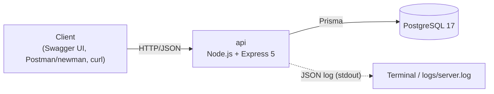
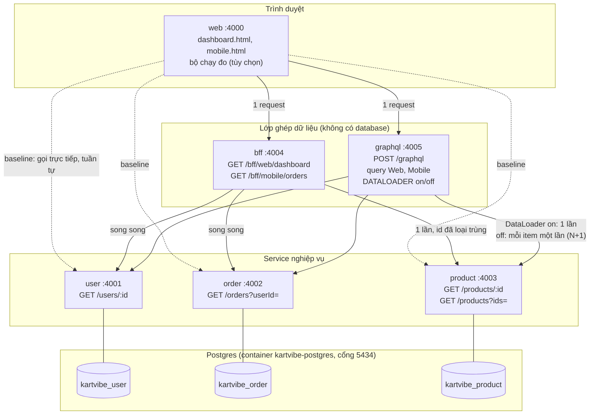
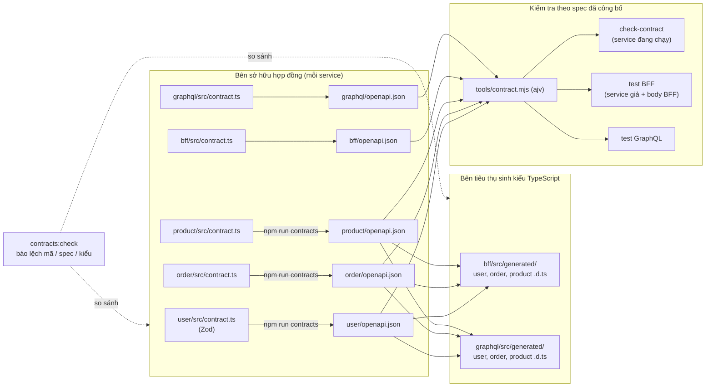
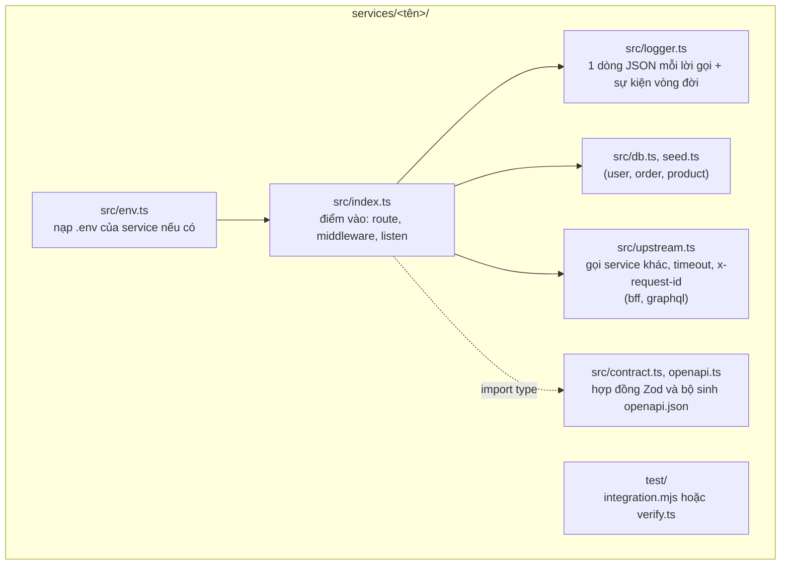
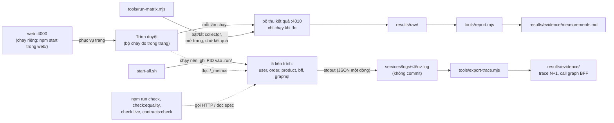
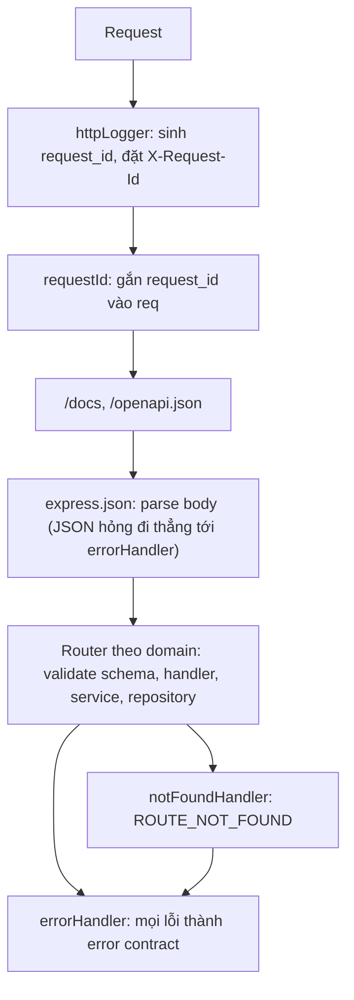

# Architecture

Kiến trúc hiện tại và cách repo được tổ chức. Repo có **hai dự án độc lập**, cùng một repo và **chưa liên kết** với nhau: `api` và `services` + `web`. Chúng có thể khác kiến trúc. Việc viết `services` thành ba service riêng (User, Order, Product) là yêu cầu của đề bài; việc đặt chung một repo và tiếp tục phát triển cùng dự án cũ là quyết định của nhóm. Phần "Mở rộng dự kiến" ở cuối là dự đoán, chưa phải quyết định.

## 1. Tổng quan

### `api`

Một ứng dụng một process và một database.



| Thành phần | Công nghệ | Cổng mặc định | Ghi chú |
|---|---|---|---|
| `api` | Node.js, Express 5, TypeScript (chạy bằng `tsx`), Zod, Prisma 7 | 3000 | REST API giỏ hàng; tài liệu tại `/docs` và `/openapi.json` |
| PostgreSQL | Postgres 17 (Docker) | 5434 | Dữ liệu duy nhất của hệ thống; xem `api/README.md` để dựng |

Lý do chọn công nghệ: xem [decisions/](decisions/README.md).

### `services` + `web` (API composition)

Nhiều service REST, mỗi service một database riêng, cùng hai cách ghép dữ liệu ở server (BFF và GraphQL) so với baseline là trình duyệt gọi trực tiếp. Hướng dẫn chạy: [services/README.md](../services/README.md).

**Kiến trúc khi chạy.** Ba cách lấy cùng một dữ liệu dashboard khác nhau ở nơi ghép: ở trình duyệt (baseline), ở BFF, hoặc ở GraphQL. BFF và GraphQL chỉ gọi service qua REST, không chạm database.



Mọi service có thêm `GET /health`, `GET /_metrics` (số request và truy vấn DB) và `POST /_metrics/reset`. `x-request-id` được truyền từ BFF/GraphQL xuống các service để nối log của một request.

| Thành phần | Cổng | Database | Ghi chú |
|---|---|---|---|
| `user`, `order`, `product` | 4001, 4002, 4003 | `kartvibe_user`, `kartvibe_order`, `kartvibe_product` (cùng một server Postgres) | `product` có endpoint lấy nhiều id và công tắc gây lỗi; `order` luôn 2 truy vấn |
| `bff` | 4004 | không | Hai endpoint: web và mobile |
| `graphql` | 4005 | không | Một endpoint, hai query; công tắc `DATALOADER` |
| `web` | 4000 | không | Trang dashboard và mobile, bộ chạy đo trong trang |

#### Hợp đồng và kiểu giữa các service

Mỗi service sở hữu hợp đồng của mình; bên tiêu thụ chỉ phụ thuộc vào artifact đã công bố, không import mã của nhau ([ADR 0011](decisions/0011-hop-dong-openapi-do-service-so-huu.md)).



#### Cấu trúc bên trong một service



#### Vận hành, log và đo



Quyết định, hợp đồng và Plan: [docs/blocks/block-02/](blocks/block-02/); sơ đồ và ghi chú trình bày: [so-do-kien-truc.html](blocks/block-02/so-do-kien-truc.html).

### Quan hệ giữa hai dự án

Chưa có liên kết: `services` không gọi `api` và ngược lại; dùng chung container Postgres (`kartvibe-postgres`, cổng 5434) nhưng database khác nhau (`kartvibe` cho `api`; `kartvibe_user`, `kartvibe_order`, `kartvibe_product` cho `services`). Về sau có thể dùng lại dự án nào hoặc thêm thư mục mới; khi cần liên kết sẽ có ADR riêng.

## 2. Vòng đời một request (`api`)

Thứ tự middleware trong `api/src/app.ts` có ý nghĩa, đổi thứ tự sẽ làm hỏng một số bảo đảm.



- `httpLogger` và `requestId` đứng đầu để mọi dòng log và mọi response, kể cả lỗi, đều có `request_id`.
- `validate` chạy trước service nên request sai schema không chạm DB.
- Mọi lỗi cuối cùng đi qua `errorHandler`, nơi duy nhất quyết định định dạng lỗi; xem [api/docs/CONVENTIONS.md](../api/docs/CONVENTIONS.md).

## 3. Cấu trúc repo

```
kartvibe/
  api/                       REST API giỏ hàng
    src/
      <domain>/              products, carts (gồm mục trong giỏ): routes, handler, service, repository
      shared/                db, errors, logger, middleware
      openapi/               Zod schemas và registry sinh OpenAPI
    prisma/                  schema và migration
    seeds/                   dữ liệu seed
    scripts/                 migrate, seed, reset
    evidence/ postman/       bằng chứng nghiệm thu (Postman + newman)
    docs/                    tài liệu riêng của api
  services/                  các service và công cụ
    user/ order/ product/ bff/ graphql/   năm service, mỗi service một README
    start-all.sh stop-all.sh              chạy và dừng tất cả
    logs/                    log thô của các service (start-all.sh ghi stdout vào đây, không commit)
    tools/                   công cụ kiểm tra và đo (xem tools/README.md)
  web/                       trang dashboard, mobile và bộ chạy đo
  results/                   bằng chứng và kết quả đo của services (evidence, verification, raw)
  docs/                      tài liệu gốc (xem docs/README.md); docs/blocks/block-NN: tài liệu theo block
```

Quy tắc đặt tên và nơi đặt tài liệu: [docs/README.md](README.md). Quy ước viết mã trong `api`: [api/docs/CONVENTIONS.md](../api/docs/CONVENTIONS.md).

## 4. Dữ liệu, log, cấu hình

- **Dữ liệu:** `api` dùng một database Postgres; cấu trúc và quy tắc ở [domain/](domain/README.md). `services` dùng ba database riêng (xem trên); dữ liệu mẫu có công thức xác định, nằm trong hợp đồng của `services` (xem [docs/blocks/block-02/](blocks/block-02/)).
- **Log:** `api` ghi JSON mỗi dòng ra stdout; muốn lưu file dùng `npm run start:log`. Xem [ADR 0004](decisions/0004-logging-pino-request-id.md). Các service chỉ ghi mỗi lời gọi nghiệp vụ một dòng JSON kèm `requestId` ra stdout (định dạng chung); `services/start-all.sh` đóng vai hạ tầng log cục bộ, ghi stdout vào `services/logs/<service>.log` (không commit) để dựng trace N+1 và call graph. Xem [ADR 0009](decisions/0009-log-stdout-moc-do-sau-co.md).
- **Cấu hình:** biến môi trường trong `api/.env` (mẫu ở `.env.example`); `.env` không được commit.
- **Nhất quán dữ liệu:** transaction và khóa dòng cho thao tác ghi trên giỏ; xem [domain/cart.md](domain/cart.md#đồng-thời).

## 5. Mở rộng dự kiến (chưa cam kết)

Lộ trình môn học nhắc tới nhiều thành phần mà hệ thống chưa có. Yêu cầu chính xác của giảng viên chưa rõ, nên bảng dưới chỉ là dự đoán để chuẩn bị. Thành phần nào thật sự được thêm sẽ có ADR riêng, và chỉ thêm khi có lý do kỹ thuật, không chỉ để áp dụng một công nghệ.

| Chủ đề trong lộ trình | Thành phần có thể cần |
|---|---|
| Tổng hợp dữ liệu cho dashboard | **Đã làm** trong `services/` và `web/` (BFF, GraphQL, trang web) |
| REST cho browser, gRPC giữa các service | một service nội bộ thứ hai (ví dụ tồn kho) |
| Xử lý order bất đồng bộ, outbox (các block về broker) | message broker, `worker` |
| Cache, stampede | Redis |
| Timeout, retry khi dịch vụ ngoài lỗi | dịch vụ giả lập (shipping, payment) |
| Logs, metrics, traces | OpenTelemetry collector |
| Tích hợp LLM, MCP | thành phần `mcp` |

Thử nghiệm để tự học (chưa chắc được dùng) không đặt vào codebase chính; làm trên nhánh riêng, khi repo có git.
