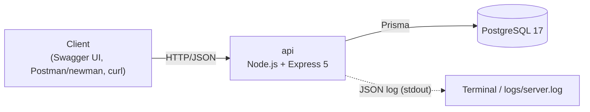
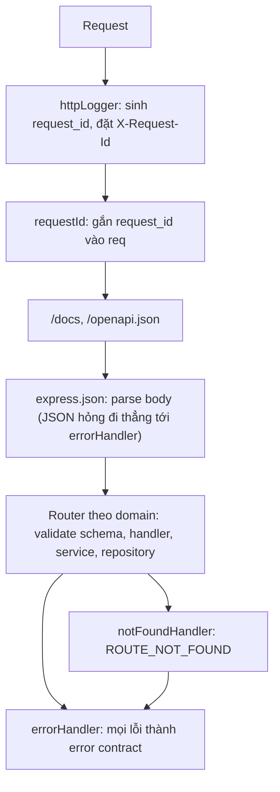

# Architecture

Kiến trúc hiện tại của hệ thống và cách repo được tổ chức. Phần "Mở rộng dự kiến" ở cuối là dự đoán, chưa phải quyết định.

## 1. Tổng quan

Hiện hệ thống là một ứng dụng một process và một database.



| Thành phần | Công nghệ | Cổng mặc định | Ghi chú |
|---|---|---|---|
| `api` | Node.js, Express 5, TypeScript (chạy bằng `tsx`), Zod, Prisma 7 | 3000 | REST API giỏ hàng; tài liệu tại `/docs` và `/openapi.json` |
| PostgreSQL | Postgres 17 (Docker) | 5434 | Dữ liệu duy nhất của hệ thống; xem `api/README.md` để dựng |

Lý do chọn công nghệ: xem [decisions/](decisions/README.md).

## 2. Vòng đời một request

Thứ tự middleware trong `api/src/app.ts` có ý nghĩa, đổi thứ tự sẽ làm hỏng một số bảo đảm.



- `httpLogger` và `requestId` đứng đầu để mọi dòng log và mọi response, kể cả lỗi, đều có `request_id`.
- `validate` chạy trước service nên request sai schema không chạm DB.
- Mọi lỗi cuối cùng đi qua `errorHandler`, nơi duy nhất quyết định định dạng lỗi; xem [api/docs/CONVENTIONS.md](../api/docs/CONVENTIONS.md).

## 3. Cấu trúc repo

```
kartvibe/
  api/                       REST API (hiện là thành phần duy nhất)
    src/
      <domain>/              products, carts (gồm mục trong giỏ): routes, handler, service, repository
      shared/                db, errors, logger, middleware
      openapi/               Zod schemas và registry sinh OpenAPI
    prisma/                  schema và migration
    seeds/                   dữ liệu seed
    scripts/                 migrate, seed, reset
    evidence/ postman/       bằng chứng nghiệm thu (Postman + newman)
    docs/                    tài liệu riêng của api
  docs/                      tài liệu gốc (xem docs/README.md)
```

Quy tắc đặt tên và nơi đặt tài liệu: [docs/README.md](README.md). Quy ước viết mã trong `api`: [api/docs/CONVENTIONS.md](../api/docs/CONVENTIONS.md).

## 4. Dữ liệu, log, cấu hình

- **Dữ liệu:** một database Postgres; cấu trúc và quy tắc ở [domain/](domain/README.md).
- **Log:** JSON mỗi dòng ra stdout; muốn lưu file dùng `npm run start:log`. Xem [ADR 0004](decisions/0004-logging-pino-request-id.md).
- **Cấu hình:** biến môi trường trong `api/.env` (mẫu ở `.env.example`); `.env` không được commit.
- **Nhất quán dữ liệu:** transaction và khóa dòng cho thao tác ghi trên giỏ; xem [domain/cart.md](domain/cart.md#đồng-thời).

## 5. Mở rộng dự kiến (chưa cam kết)

Lộ trình môn học nhắc tới nhiều thành phần mà hệ thống chưa có. Yêu cầu chính xác của giảng viên chưa rõ, nên bảng dưới chỉ là dự đoán để chuẩn bị. Thành phần nào thật sự được thêm sẽ có ADR riêng, và chỉ thêm khi có lý do kỹ thuật, không chỉ để áp dụng một công nghệ.

| Chủ đề trong lộ trình | Thành phần có thể cần |
|---|---|
| Tổng hợp dữ liệu cho dashboard (Block 2) | BFF hoặc GraphQL, frontend `web/` |
| REST cho browser, gRPC giữa các service (Block 3) | một service nội bộ thứ hai (ví dụ tồn kho) |
| Xử lý order bất đồng bộ, outbox (các block về broker) | message broker, `worker` |
| Cache, stampede | Redis |
| Timeout, retry khi dịch vụ ngoài lỗi | dịch vụ giả lập (shipping, payment) |
| Logs, metrics, traces | OpenTelemetry collector |
| Tích hợp LLM, MCP | thành phần `mcp` |

Thử nghiệm để tự học (chưa chắc được dùng) không đặt vào codebase chính; làm trên nhánh riêng, khi repo có git.
