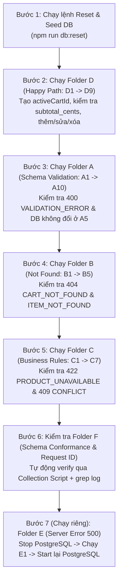

# TEST MATRIX & EVIDENCE PLAN — Cart API

> **Người phụ trách**: Luân (QA & Evidence Planner)
> **Mục đích**: Thiết kế toàn bộ ma trận kịch bản nghiệm thu (Acceptance Test Matrix), quy ước biến môi trường, thứ tự chạy và đặc tả **Postman Collection** để hiện thực hóa bộ script nghiệm thu.

---

## 1. Quyết định công cụ & Format Script Nghiệm thu

### Lựa chọn: **Postman Collection (`postman_collection.json`) + Postman Environment (`postman_environment.json`)** (kèm hỗ trợ chạy CLI qua `newman`)

**Lý do chọn Postman:**
1. **Dễ thao tác và trực quan khi Demo / Nghiệm thu**: Có GUI rõ ràng, phân chia theo từng Folder (`D - Happy Path`, `A - Schema Validation`, `B - 404 Not Found`, `C - Business Rules`, `E - 500 Server Error`, `F - Spec & Logging`), dễ bấm chạy lẻ từng request khi giảng viên hỏi bất kỳ dòng nào trong ma trận.
2. **Tự động hóa truyền biến (Chaining Requests)**: Dùng tab **Scripts → Post-response** (`pm.collectionVariables.set("activeCartId", res.id)`) để tự động lấy `cartId` vừa tạo từ `POST /carts` truyền sang các bước `GET / POST / PATCH / DELETE` kế tiếp mà không cần copy-paste thủ công.
3. **Tự động kiểm tra kết quả (Automated Assertions)**: Dùng `pm.test()` và `pm.response.to.have.jsonSchema()` để tự động assert HTTP Status, Error Contract (`code`, `message`, `details`, `request_id`), header `X-Request-Id`, và tính toán `subtotal_cents`.
4. **Đảm bảo yêu cầu "Script chạy lại được"**:
   - **Cách 1 (UI)**: Bấm **Run Collection** trong Postman Collection Runner để chạy một mạch toàn bộ test cases.
   - **Cách 2 (CLI)**: Chạy lệnh `npx newman run postman/cart-api.postman_collection.json -e postman/cart-api.postman_environment.json` trong terminal sau khi chạy `npm run db:reset`.

---

## 2. Quy ước Seed Data & Biến Môi trường (Postman Variables)

Để kịch bản test khớp với thiết kế DB của **`DB_DESIGN.md`**, bộ Postman Environment sử dụng các biến chuẩn sau (chỉ cần đồng bộ UUID trong file seed với file environment này):

### 2.1. Bảng Seed Data tham chiếu trong Test

| Ký hiệu | Cột `id` (UUID đã chốt) | `sku` | `name` | `price_cents` | `stock` | `is_active` | Mục đích test |
|---------|-----------------------------|-------|--------|--------------:|--------:|:-----------:|---------------|
| **SP1** | `10000000-0000-4000-8000-000000000001` | `SKU-001` | Bút bi xanh | `5000` | `3` | `true` | Happy path, cộng `subtotal_cents`; đã nằm trong giỏ từ D5 nên POST lại ra `ITEM_ALREADY_IN_CART` (C4/C4b) |
| **SP2** | `10000000-0000-4000-8000-000000000002` | `SKU-002` | Vở kẻ ngang | `15000` | `50` | `true` | Happy path, thêm SP thứ 2, xóa item |
| **SP3** | `10000000-0000-4000-8000-000000000003` | `SKU-003` | Thước kẻ 30cm | `8000` | **`1`** | `true` | Test vượt tồn kho: stock=1, gửi qty=2 (>1, ≤10) |
| **SP4** | `10000000-0000-4000-8000-000000000004` | `SKU-004` | Bút xóa | `12000` | **`0`** | `true` | Test hết hàng (`stock = 0` → `409 INSUFFICIENT_STOCK`) |
| **SP5** | `10000000-0000-4000-8000-000000000005` | `SKU-005` | Compa | `25000` | `10` | **`false`** | Test SP ngừng bán (`is_active = false` → `422 PRODUCT_UNAVAILABLE`) |

| Ký hiệu Cart | Cột `id` (UUID đã chốt) | `status` | Mục đích test |
|--------------|-----------------------------|----------|---------------|
| **CART_CLOSED** | `20000000-0000-4000-8000-000000000001` | `checked_out` | Test lỗi ghi vào giỏ hàng đã đóng (`409 CART_CLOSED`) |

> [!IMPORTANT]
> **Lưu ý quan trọng về `stock` của SP3**:
> Vì Schema Validation giới hạn `quantity` trong khoảng `1..10` (nếu gửi `quantity = 11` sẽ bị chặn ở tầng Schema với lỗi `400 VALIDATION_ERROR`), nên để test vượt tồn kho (**C3**) seed cần sản phẩm có `1 <= stock < 10`. **Đã chốt: SP1 (stock=3) và SP3 (stock=1).** Vì `ITEM_ALREADY_IN_CART` được kiểm tra **trước** `INSUFFICIENT_STOCK`, SP1 (đã có trong giỏ từ D5) không dùng được cho C3 — **C3 dùng SP3 với qty=2** (SP3 chưa có trong giỏ).

### 2.2. Danh sách biến trong Postman (`cart-api.postman_environment.json`)

| Tên biến Postman | Giá trị khởi tạo | Cách cập nhật |
|------------------|------------------|---------------|
| `{{baseUrl}}` | `http://localhost:3000` | Cố định (hoặc đổi port) |
| `{{product1Id}}` | `10000000-0000-4000-8000-000000000001` | SP1 — Bút bi xanh, price=5000, stock=3 |
| `{{product2Id}}` | `10000000-0000-4000-8000-000000000002` | SP2 — Vở kẻ ngang, price=15000, stock=50 |
| `{{product3Id}}` | `10000000-0000-4000-8000-000000000003` | SP3 — Thước kẻ 30cm, price=8000, stock=1 |
| `{{product4Id}}` | `10000000-0000-4000-8000-000000000004` | SP4 — Bút xóa, stock=0 (hết hàng) |
| `{{product5Id}}` | `10000000-0000-4000-8000-000000000005` | SP5 — Compa, is_active=false (ngừng bán) |
| `{{checkedOutCartId}}` | `20000000-0000-4000-8000-000000000001` | Cart có `status = 'checked_out'` |
| `{{notFoundUuid}}` | `99999999-9999-4999-8999-999999999999` | UUID hợp lệ nhưng không tồn tại trong DB |
| `{{activeCartId}}` | *(rỗng)* | Tự động gán bằng script khi chạy `POST /carts` |
| `{{lastRequestId}}` | *(rỗng)* | Tự động lưu `request_id` của response lỗi gần nhất để đối chiếu log |

---

## 3. Ma trận Nghiệm thu Đầy đủ (Full Acceptance Test Matrix)

### Nhóm D: Happy Path — Luồng nghiệp vụ thành công (Chạy đầu tiên sau khi Reset DB)

Mục tiêu: Xác nhận toàn bộ 6 endpoints hoạt động đúng thiết kế, tạo `{{activeCartId}}` dùng chung và kiểm chứng công thức tính tay `subtotal_cents`.

| Mã | Kịch bản | Method & Endpoint | Request Body / Query | Kết quả mong đợi (Status, Headers & Body) |
|:--:|----------|-------------------|----------------------|-------------------------------------------|
| **D1** | Xem danh sách sản phẩm đang bán | `GET {{baseUrl}}/products` | — | • Status: `200 OK`<br>• Header `X-Request-Id` tồn tại<br>• `data` chứa đúng **4 sản phẩm** (`SP1, SP2, SP3, SP4` có `is_active = true`)<br>• **Không** chứa `SP5` (`is_active = false`)<br>• Mặc định `limit = 20`, `offset = 0`, `total = 4` |
| **D2** | Xem sản phẩm có phân trang | `GET {{baseUrl}}/products?limit=2&offset=0`<br>và<br>`GET {{baseUrl}}/products?limit=2&offset=2` | Query: `limit=2&offset=0` rồi `limit=2&offset=2` | • Status: `200 OK`<br>• Mỗi trang trả về `data.length == 2`<br>• Danh sách ID ở 2 trang không trùng nhau |
| **D3** | Tạo giỏ hàng mới (rỗng) | `POST {{baseUrl}}/carts` | *(Không có body)* | • Status: `201 Created`<br>• Header `Location: /carts/<id>`<br>• Body: `{ "id": "<uuid>", "status": "open", "items": [], "subtotal_cents": 0 }`<br>• **Script**: Lưu `id` vào `{{activeCartId}}` |
| **D4** | Xem giỏ hàng rỗng vừa tạo | `GET {{baseUrl}}/carts/{{activeCartId}}` | — | • Status: `200 OK`<br>• Body: `id == {{activeCartId}}`, `status == "open"`, `items == []`, `subtotal_cents == 0` |
| **D5** | Thêm 1 sản phẩm (SP1, `qty = 2`) & kiểm tra `subtotal_cents` | `POST {{baseUrl}}/carts/{{activeCartId}}/items` | `{"product_id": "{{product1Id}}", "quantity": 2}` | • Status: `201 Created`<br>• `items` có 1 phần tử: `product_id = SP1`, `price_cents = 5000`, `quantity = 2`, `subtotal_cents = 10000`<br>• Tổng giỏ hàng: **`subtotal_cents = 10000`** (`5000 × 2`) |
| **D6** | Thêm sản phẩm thứ 2 (SP2, `qty = 1`) & GET lại giỏ hàng | `POST {{baseUrl}}/carts/{{activeCartId}}/items`<br>sau đó<br>`GET {{baseUrl}}/carts/{{activeCartId}}` | `{"product_id": "{{product2Id}}", "quantity": 1}` | • POST trả `201 Created`, GET trả `200 OK`<br>• `items` có 2 phần tử (SP1: `10000`, SP2: `15000`)<br>• Tổng giỏ hàng tính tay: **`subtotal_cents = 25000`** (`2×5000 + 1×15000`) |
| **D7** | Cập nhật số lượng SP1 thành `quantity = 3` | `PATCH {{baseUrl}}/carts/{{activeCartId}}/items/{{product1Id}}` | `{"quantity": 3}` | • Status: `200 OK`<br>• Item SP1 cập nhật `quantity = 3`, `subtotal_cents = 15000`<br>• Tổng giỏ hàng mới: **`subtotal_cents = 30000`** (`3×5000 + 1×15000`) |
| **D8** | Xóa SP2 khỏi giỏ hàng | `DELETE {{baseUrl}}/carts/{{activeCartId}}/items/{{product2Id}}` | *(Không có body)* | • Status: `204 No Content`<br>• Response body hoàn toàn rỗng |
| **D9** | Xem lại giỏ hàng sau khi xóa SP2 | `GET {{baseUrl}}/carts/{{activeCartId}}` | — | • Status: `200 OK`<br>• `items` chỉ còn 1 phần tử là SP1 (`quantity = 3`)<br>• Tổng giỏ hàng: **`subtotal_cents = 15000`** |

---

### Nhóm A: Validate Schema — Request sai định dạng (400 VALIDATION_ERROR, không chạm DB)

Mục tiêu: Chứng minh mọi dữ liệu sai kiểu, vượt biên `1..10`, thiếu trường bắt buộc, dư trường lạ (`additionalProperties: false`) hoặc sai định dạng UUID đều bị chặn ngay ở tầng Boundary Validation với mã `400 VALIDATION_ERROR` và **tuyệt đối không làm thay đổi DB**.

| Mã | Kịch bản | Method & Endpoint | Input (Body / Params) | Kết quả mong đợi |
|:--:|----------|-------------------|-----------------------|------------------|
| **A1** | `quantity = 0` (nhỏ hơn minimum = 1) | `POST {{baseUrl}}/carts/{{activeCartId}}/items` | `{"product_id": "{{product1Id}}", "quantity": 0}` | • Status: `400 Bad Request`<br>• `code`: `"VALIDATION_ERROR"`<br>• `details`: chứa phần tử chỉ rõ field `quantity` |
| **A2** | `quantity = 11` (lớn hơn maximum = 10) | `POST {{baseUrl}}/carts/{{activeCartId}}/items` | `{"product_id": "{{product1Id}}", "quantity": 11}` | • Status: `400 Bad Request`<br>• `code`: `"VALIDATION_ERROR"`<br>• `details`: chỉ rõ field `quantity` |
| **A3** | `quantity = "2"` (sai kiểu: string thay vì integer) | `POST {{baseUrl}}/carts/{{activeCartId}}/items` | `{"product_id": "{{product1Id}}", "quantity": "2"}` | • Status: `400 Bad Request`<br>• `code`: `"VALIDATION_ERROR"`<br>• `details`: chỉ rõ field `quantity` |
| **A4** | Thiếu `product_id` (field bắt buộc) | `POST {{baseUrl}}/carts/{{activeCartId}}/items` | `{"quantity": 2}` | • Status: `400 Bad Request`<br>• `code`: `"VALIDATION_ERROR"`<br>• `details`: chỉ rõ field `product_id` |
| **A5** | Body có field lạ (`price` / `price_cents`) & kiểm tra DB không đổi | 1. `POST {{baseUrl}}/carts/{{activeCartId}}/items`<br>2. `GET {{baseUrl}}/carts/{{activeCartId}}` | `{"product_id": "{{product2Id}}", "quantity": 2, "price": 999}` | • Bước 1: `400` · `VALIDATION_ERROR` (do `additionalProperties: false`)<br>• Bước 2: GET lại giỏ thấy `items.length` vẫn bằng `1` và `subtotal_cents` vẫn là `15000` (DB không đổi) |
| **A6** | `cartId` trên URL không phải UUID | `GET {{baseUrl}}/carts/abc-123-not-uuid` | Path param `cartId = abc-123-not-uuid` | • Status: `400 Bad Request`<br>• `code`: `"VALIDATION_ERROR"`<br>• `details`: chỉ rõ field `cartId` |
| **A7** | `quantity = 0` hoặc `11` khi PATCH item | `PATCH {{baseUrl}}/carts/{{activeCartId}}/items/{{product1Id}}` | `{"quantity": 0}` | • Status: `400 Bad Request`<br>• `code`: `"VALIDATION_ERROR"`<br>• `details`: chỉ rõ field `quantity` |
| **A8** | Body rỗng `{}` khi POST thêm item | `POST {{baseUrl}}/carts/{{activeCartId}}/items` | `{}` | • Status: `400 Bad Request`<br>• `code`: `"VALIDATION_ERROR"` |
| **A9** | Query `limit` hoặc `offset` sai quy định | `GET {{baseUrl}}/products?limit=0&offset=-1` | Query `limit=0`, `offset=-1` | • Status: `400 Bad Request`<br>• `code`: `"VALIDATION_ERROR"` |
| **A10** | `productId` trên URL không phải UUID khi PATCH/DELETE | `DELETE {{baseUrl}}/carts/{{activeCartId}}/items/not-a-uuid` | Path param `productId = not-a-uuid` | • Status: `400 Bad Request`<br>• `code`: `"VALIDATION_ERROR"` |
| **A11** | JSON hỏng | `POST {{baseUrl}}/carts/{{activeCartId}}/items` | Raw body: `{"product_id": ` | • Status: `400`<br>• `code`: `"VALIDATION_ERROR"`<br>• `details`: field `body` |
| **A12** | Query param lạ | `GET {{baseUrl}}/products?page=2` | — | • Status: `400`<br>• `code`: `"VALIDATION_ERROR"`<br>• `details`: field `page` |

---

### Nhóm B: Resource không tìm thấy (404 NOT FOUND)

Mục tiêu: Kiểm tra khi UUID đúng định dạng nhưng bản ghi không tồn tại trong DB.

| Mã | Kịch bản | Method & Endpoint | Setup & Input | Kết quả mong đợi |
|:--:|----------|-------------------|---------------|------------------|
| **B1** | Xem giỏ hàng với `cartId` không tồn tại | `GET {{baseUrl}}/carts/{{notFoundUuid}}` | `cartId = {{notFoundUuid}}` | • Status: `404 Not Found`<br>• `code`: `"CART_NOT_FOUND"`<br>• Có `request_id` hợp lệ |
| **B2** | Thêm item vào `cartId` không tồn tại | `POST {{baseUrl}}/carts/{{notFoundUuid}}/items` | Body: `{"product_id": "{{product1Id}}", "quantity": 1}` | • Status: `404 Not Found`<br>• `code`: `"CART_NOT_FOUND"` |
| **B3** | Xóa một sản phẩm chưa có trong giỏ | `DELETE {{baseUrl}}/carts/{{activeCartId}}/items/{{product2Id}}` | Dùng `{{activeCartId}}` (SP2 đã xóa ở D8 nên không còn trong giỏ) | • Status: `404 Not Found`<br>• `code`: `"ITEM_NOT_FOUND"` |
| **B4** | PATCH số lượng của sản phẩm chưa có trong giỏ | `PATCH {{baseUrl}}/carts/{{activeCartId}}/items/{{product2Id}}` | Body: `{"quantity": 2}` (SP2 chưa có trong giỏ) | • Status: `404 Not Found`<br>• `code`: `"ITEM_NOT_FOUND"` |
| **B5** | PATCH/DELETE khi cả `cartId` cũng không tồn tại | `DELETE {{baseUrl}}/carts/{{notFoundUuid}}/items/{{product1Id}}` | `cartId = {{notFoundUuid}}` | • Status: `404 Not Found`<br>• `code`: `"CART_NOT_FOUND"` (ưu tiên check Cart trước Item theo `BUSINESS_LOGIC.md`) |
| **B6** | Route không tồn tại | `GET {{baseUrl}}/foo` | — | • Status: `404`<br>• `code`: `"ROUTE_NOT_FOUND"` |
| **B7** | Method không hỗ trợ | `PUT {{baseUrl}}/carts` | — | • Status: `405`<br>• `code`: `"METHOD_NOT_ALLOWED"` |

---

### Nhóm C: Vi phạm Business Rules (409 CONFLICT & 422 UNPROCESSABLE ENTITY)

Mục tiêu: Kiểm tra toàn bộ quy tắc nghiệp vụ và đúng thứ tự ưu tiên đã định nghĩa trong `BUSINESS_LOGIC.md`.

| Mã | Kịch bản | Method & Endpoint | Setup & Input | Kết quả mong đợi |
|:--:|----------|-------------------|---------------|------------------|
| **C1** | Thêm sản phẩm đã ngừng bán (`is_active = false`) | `POST {{baseUrl}}/carts/{{activeCartId}}/items` | Dùng **SP5**: `{"product_id": "{{product5Id}}", "quantity": 1}` | • Status: `422 Unprocessable Entity`<br>• `code`: `"PRODUCT_UNAVAILABLE"` |
| **C1b** | Thêm sản phẩm có UUID không tồn tại trong bảng `products` | `POST {{baseUrl}}/carts/{{activeCartId}}/items` | Dùng `{{notFoundUuid}}`: `{"product_id": "{{notFoundUuid}}", "quantity": 1}` | • Status: `422 Unprocessable Entity`<br>• `code`: `"PRODUCT_UNAVAILABLE"` |
| **C2** | Thêm sản phẩm đã hết hàng (`stock = 0`) | `POST {{baseUrl}}/carts/{{activeCartId}}/items` | Dùng **SP4**: `{"product_id": "{{product4Id}}", "quantity": 1}` | • Status: `409 Conflict`<br>• `code`: `"INSUFFICIENT_STOCK"` |
| **C3** | Thêm sản phẩm vượt quá tồn kho hiện tại (`quantity > stock`) | `POST {{baseUrl}}/carts/{{activeCartId}}/items` | Dùng **SP3** (`stock = 1`, chưa có trong giỏ), gửi `quantity = 2`: `{"product_id": "{{product3Id}}", "quantity": 2}` | • Status: `409 Conflict`<br>• `code`: `"INSUFFICIENT_STOCK"`<br>• `details` chỉ rõ field `quantity` |
| **C3a** | Thêm SP3 `qty = 1` (đúng bằng stock) — chuẩn bị cho C3b | `POST {{baseUrl}}/carts/{{activeCartId}}/items` | `{"product_id": "{{product3Id}}", "quantity": 1}` | • Status: `201 Created` |
| **C3b** | PATCH số lượng vượt quá tồn kho hiện tại | `PATCH {{baseUrl}}/carts/{{activeCartId}}/items/{{product3Id}}` | Body: `{"quantity": 2}` (`> stock 1`) | • Status: `409 Conflict`<br>• `code`: `"INSUFFICIENT_STOCK"` |
| **C4** | Thêm sản phẩm đã có sẵn trong giỏ hàng | `POST {{baseUrl}}/carts/{{activeCartId}}/items` | Dùng **SP1** (đã có trong `{{activeCartId}}` từ D5): `{"product_id": "{{product1Id}}", "quantity": 1}` | • Status: `409 Conflict`<br>• `code`: `"ITEM_ALREADY_IN_CART"` |
| **C4b** | SP đã có trong giỏ **và** `quantity > stock` — chốt thứ tự lỗi | `POST {{baseUrl}}/carts/{{activeCartId}}/items` | SP1 (đã có từ D5, stock=3): `{"product_id": "{{product1Id}}", "quantity": 4}` | • Status: `409 Conflict`<br>• `code`: `"ITEM_ALREADY_IN_CART"` (không phải `INSUFFICIENT_STOCK`) |
| **C5** | POST thêm item vào giỏ hàng đã `checked_out` | `POST {{baseUrl}}/carts/{{checkedOutCartId}}/items` | Dùng `{{checkedOutCartId}}` từ seed: `{"product_id": "{{product1Id}}", "quantity": 1}` | • Status: `409 Conflict`<br>• `code`: `"CART_CLOSED"` |
| **C6** | PATCH sửa số lượng trên giỏ hàng đã `checked_out` | `PATCH {{baseUrl}}/carts/{{checkedOutCartId}}/items/{{product1Id}}` | Dùng `{{checkedOutCartId}}`, Body: `{"quantity": 2}` | • Status: `409 Conflict`<br>• `code`: `"CART_CLOSED"` |
| **C7** | DELETE xóa item trên giỏ hàng đã `checked_out` | `DELETE {{baseUrl}}/carts/{{checkedOutCartId}}/items/{{product1Id}}` | Dùng `{{checkedOutCartId}}` | • Status: `409 Conflict`<br>• `code`: `"CART_CLOSED"` |
| **C8** | GET cart đã `checked_out` vẫn đọc được | `GET {{baseUrl}}/carts/{{checkedOutCartId}}` | — | • Status: `200 OK`<br>• `status == "checked_out"` |

---

### Nhóm E: Lỗi Hệ thống / Server Error (500 INTERNAL_ERROR)

Mục tiêu: Đảm bảo khi DB gặp sự cố bất ngờ, server vẫn bắt lỗi tập trung, trả đúng Error Contract và **không lộ thông tin nhạy cảm** (stack trace, câu lệnh SQL, biến môi trường).

| Mã | Kịch bản | Các bước thực hiện (Setup) | Request gọi thử | Kết quả mong đợi |
|:--:|----------|----------------------------|-----------------|------------------|
| **E1** | Tắt PostgreSQL rồi gọi API | 1. Dừng PostgreSQL (`docker stop <postgres_container>` hoặc tắt service PostgreSQL)<br>2. Gửi request trong Postman<br>3. Bật lại PostgreSQL ngay sau khi verify | `GET {{baseUrl}}/products` hoặc `POST {{baseUrl}}/carts` | • Status: `500 Internal Server Error`<br>• Body đúng Error Contract: `{ "code": "INTERNAL_ERROR", "message": "...", "details": [], "request_id": "<uuid>" }`<br>• Body **KHÔNG chứa** từ khóa `Error:`, `at `, `SELECT`, `INSERT`, `ECONNREFUSED`, hay stack trace |

---

### Nhóm F: Khớp OpenAPI Spec & Kiểm tra Logging (`request_id`)

Mục tiêu: Chứng minh response thực tế tuân thủ 100% OpenAPI 3.1 schema và `request_id` truy vết được từ Client xuống Server Log.

| Mã | Kịch bản | Cách kiểm tra trong Postman & Terminal | Kết quả mong đợi |
|:--:|----------|----------------------------------------|------------------|
| **F1** | Mọi response khớp với OpenAPI 3.1 Schema | Trong Postman **Collection-level Post-response Script**, gắn JSON Schema validator kiểm tra cấu trúc Cart Response (`200/201`) và Error Contract (`400/404/409/422/500`) cho tất cả các request ở Nhóm A, B, C, D, E | • 100% assertions `Schema is valid` đều **PASS**<br>• Không dư field lạ, không thiếu field `required`, đúng kiểu dữ liệu (`integer`, `uuid`, `array`) |
| **F2** | Đối chiếu `request_id` giữa Response Header, Error Body và Server Log | 1. Gọi lại kịch bản **A1** (`quantity = 0`)<br>2. Kiểm tra `pm.response.headers.get("X-Request-Id") === pm.response.json().request_id`<br>3. Copy `request_id` đó, tìm (grep) trên màn hình log của Server | • Giá trị `X-Request-Id` ở Header và `request_id` trong JSON Body trùng khớp 100%<br>• Trên terminal log của server (`pino-http`/`winston`), tìm thấy đúng dòng log chứa `request_id` đó kèm method, path, status `400` |

---

## 4. Thứ tự chạy kịch bản nghiệm thu (Execution Order)

Để bộ test **chạy lại được nhiều lần (repeatable & idempotent)** mà không bị xung đột dữ liệu giữa các lần chạy, quy trình chạy nghiệm thu được thiết kế theo đúng thứ tự sau:



### Quy trình thao tác cụ thể khi nghiệm thu:

1. **Bước 1 — Khởi tạo trạng thái sạch**:
   ```bash
   npm run db:reset
   ```
2. **Bước 2 — Chạy tự động toàn bộ luồng chính (Nhóm D → A → B → C → F)**:
   - Mở Postman → Chọn Collection **Cart API Acceptance Tests** → Chọn Environment **Cart API Local**.
   - Bấm **Run collection** (bỏ tích Folder `E - Server Error 500` vì cần tắt DB thủ công) → Bấm **Run**.
   - Hoặc chạy bằng lệnh CLI (nếu Phú tích hợp vào `package.json` dưới dạng `npm run test:evidence`):
     ```bash
     npx newman run postman/cart-api.postman_collection.json \
       -e postman/cart-api.postman_environment.json \
       --folder "D - Happy Path" \
       --folder "A - Schema Validation" \
       --folder "B - 404 Not Found" \
       --folder "C - Business Rules"
     ```
3. **Bước 3 — Chạy nghiệm thu lỗi 500 (Nhóm E)**:
   - Tắt PostgreSQL container/service:
     ```bash
     docker stop cart-postgres
     ```
   - Chạy request **E1** trong Postman → Xác nhận trả về `500 INTERNAL_ERROR` đúng contract, không có stack trace.
   - Bật lại PostgreSQL ngay lập tức:
     ```bash
     docker start cart-postgres
     ```
4. **Bước 4 — Nghiệm thu truy vết Log (`F2`)**:
   - Lấy `request_id` vừa in ra ở Console của Postman, đối chiếu trực tiếp với dòng log trên terminal chạy server.

---

## 5. Đặc tả kỹ thuật Postman Scripts (Dành cho Phú khi tạo Collection)

Phú có thể gắn đoạn script dùng chung dưới đây vào **Collection-level → Scripts → Post-response** để tự động kiểm tra Schema & `request_id` cho mọi request (Kịch bản **F1, F2**), giúp tiết kiệm thời gian viết lặp lại:

### 5.1. Collection-level Post-response Script (Kiểm tra chung cho mọi Request)

```javascript
// 1. Mọi response đều phải có header X-Request-Id
pm.test("[F2] Response must have X-Request-Id header", function () {
    pm.response.to.have.header("X-Request-Id");
});

// 2. Nếu là response lỗi (>= 400), bắt buộc tuân thủ Error Contract (F1 & F2)
if (pm.response.code >= 400) {
    const errorSchema = {
        type: "object",
        required: ["code", "message", "details", "request_id"],
        additionalProperties: false,
        properties: {
            code: { type: "string" },
            message: { type: "string" },
            details: { type: "array" },
            request_id: { type: "string" }
        }
    };

    pm.test("[F1] Error response matches Error Contract schema", function () {
        pm.response.to.have.jsonSchema(errorSchema);
    });

    pm.test("[F2] Header X-Request-Id matches body.request_id", function () {
        const body = pm.response.json();
        const headerReqId = pm.response.headers.get("X-Request-Id");
        pm.expect(body.request_id).to.eql(headerReqId);
        pm.environment.set("lastRequestId", body.request_id);
        console.log("Traceable request_id:", body.request_id);
    });

    pm.test("[E1] Error response must not leak stack trace or SQL", function () {
        const rawText = pm.response.text();
        pm.expect(rawText).to.not.include("at ");
        pm.expect(rawText).to.not.include("SELECT ");
        pm.expect(rawText).to.not.include("INSERT ");
        pm.expect(rawText).to.not.include("ECONNREFUSED");
    });
}
```

### 5.2. Script mẫu cho các Request quan trọng

- **Trong `D3 - POST /carts`**:
  ```javascript
  pm.test("D3: Status is 201 and Location header exists", function () {
      pm.response.to.have.status(201);
      pm.response.to.have.header("Location");
      const json = pm.response.json();
      pm.expect(json.status).to.eql("open");
      pm.expect(json.items).to.be.an("array").that.is.empty;
      pm.expect(json.subtotal_cents).to.eql(0);
      pm.environment.set("activeCartId", json.id);
  });
  ```

- **Trong `D6 - Thêm SP2 và kiểm tra tổng tiền tính tay`**:
  ```javascript
  pm.test("D6: subtotal_cents matches manual calculation (2*5000 + 1*15000 = 25000)", function () {
      pm.response.to.have.status(201);
      const json = pm.response.json();
      pm.expect(json.items.length).to.eql(2);
      pm.expect(json.subtotal_cents).to.eql(25000);
  });
  ```

- **Trong `A1/A2/A3 - Validate field quantity`**:
  ```javascript
  pm.test("A1-A3: Returns 400 VALIDATION_ERROR pointing to quantity", function () {
      pm.response.to.have.status(400);
      const json = pm.response.json();
      pm.expect(json.code).to.eql("VALIDATION_ERROR");
      const hasQuantityError = json.details.some(d => d.field.includes("quantity"));
      pm.expect(hasQuantityError).to.be.true;
  });
  ```