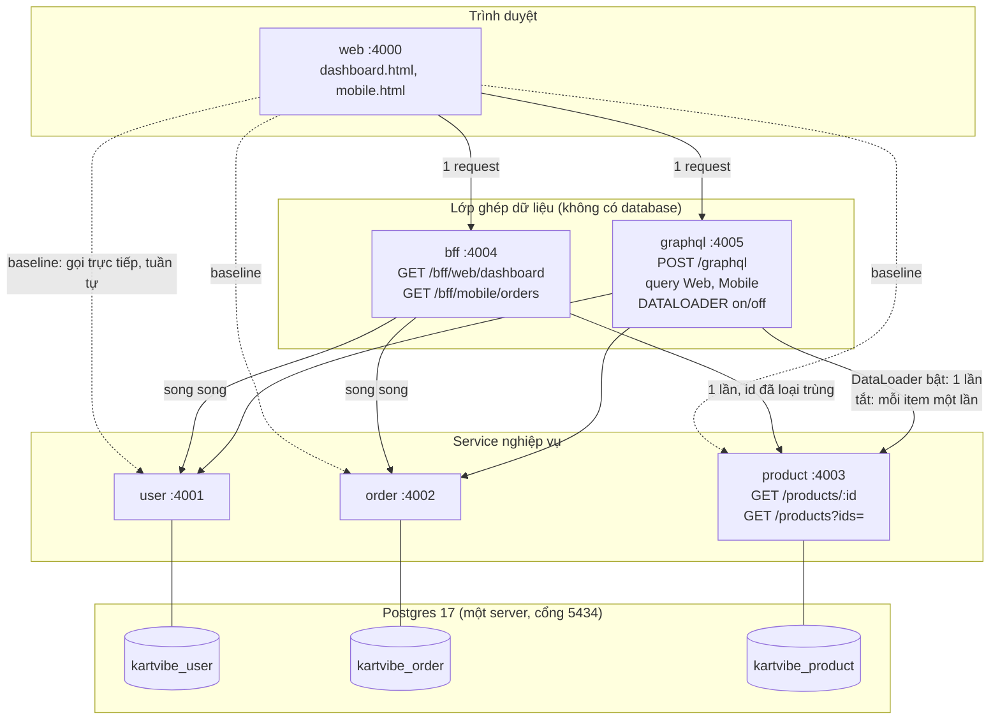

# Báo cáo Block 2: API composition

Báo cáo giải thích các lựa chọn của nhóm và dẫn tới bằng chứng trong thư mục `results/`. Cách chạy lại toàn bộ nằm ở `README.md`. Các lựa chọn dưới đây được nhóm chốt trong lúc lập Plan (`docs/blocks/block-02/PLAN.md`) và hợp đồng chung (`docs/blocks/block-02/hop-dong-chung.md`); các phương án bị loại được so sánh bằng lập luận, **nhóm không chạy thử từng phương án đó**.

## 1. Tóm tắt

Dashboard cần dữ liệu từ ba service (User, Order, Product), mỗi service một database riêng. Ở baseline, trình duyệt gọi lần lượt từng service rồi tự ghép. Nhóm đưa việc ghép sang server bằng hai cách (BFF và GraphQL), rồi đo số request của client, số lời gọi và truy vấn DB ở từng service, thời gian hoàn tất màn hình và kích thước payload, trên hai cỡ dữ liệu (S: 5 đơn, 15 item; L: 50 đơn, 200 item) và hai loại client (web, mobile).

Kết quả chính (client web, dữ liệu S, chạy ấm, median của 5 lần):

| Biến thể | Request từ client | Product nhận (request / truy vấn DB) | Thời gian hoàn tất |
|---|---:|---|---|
| Baseline | 17 | 15 / 15 | 655 ms |
| BFF | 1 | 1 / 1 | 80 ms |
| GraphQL, DataLoader tắt (N+1) | 1 | 15 / 15 | 98 ms |
| GraphQL, đã sửa (DataLoader bật) | 1 | 1 / 1 | 85 ms |

Điều đáng chú ý nhất: GraphQL ngây thơ chỉ có **1 request từ client** nhưng Product vẫn nhận 15 lời gọi (200 ở dữ liệu L). Giảm request ở trình duyệt **chưa** đồng nghĩa giảm truy vấn ở backend. Sau khi sửa N+1, số lời gọi tới Product là 1 và không tăng theo số đơn (S: 1, L: 1).

## 2. Kiến trúc

Ba biến thể cùng đọc ba service; khác biệt duy nhất là **nơi ghép dữ liệu**: ở trình duyệt (baseline), ở BFF, hoặc ở GraphQL. BFF và GraphQL chỉ gọi service qua REST, không truy vấn database.

## 3. Các lựa chọn và lý do

Mỗi mục: nhóm chọn gì, vì sao, và vì sao không chọn các phương án khác.

### 3.1 Ngôn ngữ và khung chạy

Nhóm chọn **Node.js + Express 5 + TypeScript** (chạy trực tiếp bằng `tsx`, kiểm kiểu bằng `tsc`).
- Cả năm service, trang web, bộ đo và công cụ kiểm tra dùng chung một ngôn ngữ, nên hợp đồng và kiểu có thể sinh ra rồi dùng lại ở mọi nơi.
- Express đủ cho các service chỉ có vài endpoint; dự án trước của nhóm cũng dùng Node và Express nên không tốn thời gian làm quen.
- Không chọn **Spring Boot** hay **.NET**: mạnh hơn về hệ sinh thái, nhưng thêm một ngôn ngữ và một bộ công cụ build cho bài chỉ có 65 phút thực hành.
- Không chọn **NestJS** hay **Fastify**: thêm tầng trừu tượng (module, decorator, plugin) mà bài không cần, còn mục tiêu là nhìn thấy rõ từng lời gọi và từng truy vấn.

### 3.2 Cơ sở dữ liệu

Nhóm chọn **PostgreSQL 17 trong Docker, ba database riêng** (`kartvibe_user`, `kartvibe_order`, `kartvibe_product`) **trên cùng một server**, truy cập bằng thư viện **`pg` với SQL viết tay**.
- Đề yêu cầu "mỗi service một CSDL". Ba database riêng bảo đảm không có truy vấn hay khóa ngoại xuyên service. Dùng chung một server để tiết kiệm tài nguyên máy.
- SQL viết tay cho phép kiểm soát và đếm chính xác số câu truy vấn: Order luôn đúng 2 truy vấn, lấy nhiều product luôn đúng 1 truy vấn (`WHERE id = ANY(...)`). Bộ đếm này là số liệu chính của bài.
- Không chọn **ba server Postgres riêng**: cô lập hơn nhưng tốn tài nguyên, không thay đổi kết quả cần chứng minh.
- Không chọn **ORM (Prisma...)**: tiện hơn nhưng che giấu số câu SQL thật, khó chứng minh "đúng 1 truy vấn".
- Không chọn **SQLite hay dữ liệu trong bộ nhớ**: khác công nghệ với hệ thống thật, làm số đo kém đáng tin.
- Giới hạn: một server dùng chung nên không cô lập tài nguyên giữa các service (ghi ở mục 7).

### 3.3 Giao tiếp giữa các service

Nhóm chọn **REST/JSON đồng bộ**. Đề yêu cầu REST ở bài này; gRPC và message queue chưa cần cho một dashboard chỉ đọc dữ liệu. Không chọn **gRPC** (thêm Protobuf và HTTP/2 mà chưa có lý do) hay **hàng đợi sự kiện** (dành cho tác vụ ghi bất đồng bộ, không phải đọc để hiển thị).

### 3.4 Thêm endpoint lấy nhiều product

Nhóm chọn thêm **`GET /products?ids=`** vào Product Service: loại id trùng, bỏ qua id không có, sắp theo id, **một truy vấn**.
- Muốn giảm lời gọi và truy vấn tới Product thì chính service đó phải cho phép gom; lớp ghép không tự làm được.
- Không chọn việc để BFF/GraphQL gọi từng `GET /products/:id`: đó chính là N+1.
- Giá trị phải trả: Product phải thay đổi, và mọi lớp ghép phụ thuộc vào endpoint này.

### 3.5 BFF

Nhóm chọn **hai endpoint BFF, mỗi loại client một**: `/bff/web/dashboard` (đủ trường) và `/bff/mobile/orders` (chỉ mã đơn, trạng thái, tên và thumbnail).
- Mỗi màn hình nhận đúng dữ liệu của nó trong một request.
- BFF gọi **User và Order song song**, rồi gọi Product **một lần** với id đã loại trùng. Mobile **không gọi User** vì danh sách đơn mobile không có thông tin người dùng.
- Không chọn **một endpoint chung trả đủ mọi trường cho cả hai client**: mobile sẽ nhận dữ liệu thừa (over-fetch), trái với yêu cầu "chỉ chứa các trường mobile cần".

### 3.6 GraphQL

Nhóm chọn **`graphql-js` 17 + `dataloader`**, một endpoint `POST /graphql` với hai query (`Web`, `Mobile`), chạy trên Express.
- Dùng thư viện lõi để thấy rõ resolver nào chạy khi nào và tự viết tầng gom, nên N+1 và cách sửa nhìn thấy được trong log.
- Công tắc `DATALOADER=on|off` (ghi đè từng request bằng `?dataloader=`) cho phép tái hiện N+1 rồi sửa trên cùng một mã.
- **DataLoader tạo mới cho mỗi request**: cache id chỉ sống trong một request, không rò dữ liệu giữa người dùng hay giữ dữ liệu cũ.
- Không chọn **Apollo Server** hay **GraphQL Yoga**: thêm tính năng (cache, plugin, subscription) mà bài không dùng, làm khó thấy cơ chế cốt lõi.
- Không chọn tự gom id bằng tay trong từng resolver: trùng lặp, dễ sai, và đó là việc DataLoader đã chuẩn hóa.

### 3.7 Chính sách lỗi

Nhóm chọn **trả dữ liệu một phần có đánh dấu lỗi** cho cả BFF và GraphQL; **không bao giờ điền tên hay giá giả**.
- Khi Product lỗi 500 hoặc quá **1000 ms**: các `product` bị ảnh hưởng thành `null`; BFF trả `partial: true` kèm `errors` (`PRODUCT_UNAVAILABLE`, danh sách `productIds`); GraphQL trả `errors[].extensions.code = PRODUCT_UNAVAILABLE`. Trang hiển thị "—" cho dòng thiếu.
- Một Product lỗi không nên làm hỏng cả dashboard. User hoặc Order lỗi thì lỗi toàn bộ (BFF trả 502), vì không có dữ liệu chính để hiển thị.
- Không chọn **thất bại toàn bộ**: đơn giản hơn nhưng một service phụ làm sập cả màn hình.
- Ngưỡng 1000 ms là lựa chọn của nhóm. Hệ quả: Product có thể vẫn trả lời sau đó nhưng kết quả bị coi là lỗi.

### 3.8 Hợp đồng giữa các service

Nhóm chọn **mỗi service tự sở hữu hợp đồng của mình**: `src/contract.ts` (Zod 4) sinh ra `openapi.json` (OpenAPI 3.1) đặt cạnh service. BFF và GraphQL **sinh kiểu TypeScript từ `openapi.json` của User, Order, Product** (`openapi-typescript`). Mọi bộ kiểm đều kiểm theo cùng các spec đó (`ajv`). `npm run contracts:check` báo nếu mã, spec và kiểu đã sinh lệch nhau.
- Hợp đồng là dữ liệu có thể kiểm, thuộc về bên cung cấp; bên tiêu thụ phụ thuộc vào artifact đã công bố, **không import mã của nhau**, nên không đẩy hệ thống về phía "monolith phân tán".
- Việc viết schema đã lộ ra một lỗi thật: service giả trong test của BFF trả product thiếu `sku` và `description` so với hợp đồng.
- Không chọn **chỉ một tài liệu văn bản**: không máy nào kiểm được, bên tiêu thụ lệch mà không ai biết.
- Không chọn **package kiểu dùng chung**: ràng buộc mã giữa các service.
- Không chọn **Pact** (hợp đồng do bên tiêu thụ sinh): đúng bài bản nhưng nặng so với năm service do một nhóm sở hữu.
- Không dựng **Swagger UI**: chưa cần giao diện xem tài liệu; `openapi.json` mở được bằng bất kỳ công cụ xem OpenAPI nào.

### 3.9 Cách đo

Nhóm chọn **đo ngay trong trang** bằng hàm bọc `fetch` đếm request của client, kết hợp **bộ đếm `/_metrics` của từng service** (reset trước mỗi lần chạy) cho lời gọi và truy vấn DB, và `performance.mark` cho mốc "hoàn tất".
- Các định nghĩa của đề (request từ client, DB query và service call ở từng service, màn hình hoàn tất) không có công cụ nào đo sẵn đúng như vậy, nên nhóm tự đếm và ghi rõ cách đếm (xem `results/evidence/measurements.md`, mục "Cách đếm").
- Định nghĩa **hoàn tất**: lần cập nhật DOM cuối khi mọi đơn đã hiển thị đủ tên product. Payload là tổng byte thân phản hồi; ảnh thumbnail không được tải (chỉ là chuỗi) để không làm sai số request.
- **Lạnh**: lần chạy đầu sau khi khởi động lại các service (không khởi động lại Postgres). **Ấm**: 5 lần sau. Báo median và khoảng [min–max].
- Không chọn **Lighthouse**: đo trải nghiệm trang nói chung, không đếm được lời gọi và truy vấn ở từng service.
- Không chọn **k6, ab, wrk**: đo thông lượng khi có tải, trong khi bài cần số đếm xác định cho một lần tải màn hình.
- Không chọn **OpenTelemetry** hay APM: hệ thống thu thập đầy đủ nhưng quá nặng cho năm tiến trình chạy cục bộ.

### 3.10 Log và trace

Nhóm chọn **mỗi service ghi một dòng JSON cho mỗi lời gọi ra stdout** (`ts`, `service`, `requestId`, `method`, `path`, `status`, `ms`), và **`x-request-id` được truyền từ BFF/GraphQL xuống mọi service**. Khi chạy cục bộ, `start-all.sh` ghi stdout của từng service vào `services/logs/<service>.log`. Trace N+1 và call graph được dựng bằng cách lọc log theo `requestId`.
- Không chọn **ELK / Loki**: cần ít nhất ba thành phần chạy thêm để gom log của năm tiến trình trên một máy, trong khi lọc một thư mục log theo `requestId` là đủ để chứng minh N+1.
- Không chọn **ghi file trong mã service**: đường dẫn log là việc của môi trường chạy, không phải của mã; đổi nơi lưu không phải sửa service.
- Không chọn **OpenTelemetry traces**: cùng lý do như mục 3.9.

### 3.11 Móc phục vụ test và đo

Nhóm chọn **không bật mặc định**, chỉ cắm thêm khi cần: `LATENCY_MS` (độ trễ giả mỗi request, mặc định 0) và `ENABLE_TEST_HOOKS=1` (điểm vào `/_fault` và `/_seed` của Product). `start-all.sh` chạy service như bình thường; `npm run start:measure` bật cả hai cho demo lỗi, đo và kiểm tra.
- Mã chạy thật không nên mang sẵn công tắc gây lỗi hay độ trễ giả. Đổi lại, muốn demo lỗi hay chạy `npm run check` phải khởi động bằng `start:measure`.

### 3.12 Tổ chức mã và trang web

- **npm workspaces** (một `node_modules`, một `package-lock.json` cho năm service) thay vì năm thư mục cài riêng: nhất quán phiên bản, cài một lần. Đổi lại, nâng phiên bản một thư viện kéo theo cả năm.
- Trang web dùng **HTML + JavaScript thuần, không framework, không bước build**: đếm request chính xác, không có request phụ từ công cụ build, và mã nhỏ đủ đọc. Web chạy riêng khỏi các service.
- Không chọn **React/Vite**: thêm bước build và request phụ trong chế độ dev, làm nhiễu chính con số cần đo.
- Không đóng gói service bằng **docker-compose**: số đo thời gian cần so sánh công bằng trên một máy, và Docker ở đây chỉ dùng cho Postgres.

## 4. Kết quả đo

Mọi số dưới đây lấy từ lần chạy ma trận thật bằng trình duyệt (Firefox): 4 biến thể × 2 client × 2 cỡ dữ liệu, mỗi cấu hình 1 lần lạnh + 5 lần ấm, tổng **96 bản ghi** (`results/raw/`). Cột "Ấm" là median [min–max] của 5 lần. Bảng đầy đủ kèm từng lần chạy: `results/evidence/measurements.md`.

| Dữ liệu | Client | Biến thể | Request client | Product (request / DB) | Payload (B) | Lạnh (ms) | Ấm (ms) |
|---|---|---|---:|---|---:|---:|---|
| S | web | baseline | 17 | 15 / 15 | 5093 | 712 | 655 [647–662] |
| S | web | bff | 1 | 1 / 1 | 1670 | 144 | 80 [73–83] |
| S | web | graphql-naive | 1 | 15 / 15 | 1651 | 209 | 98 [87–102] |
| S | web | graphql-fixed | 1 | 1 / 1 | 1651 | 166 | 85 [83–89] |
| S | mobile | baseline | 16 | 15 / 15 | 5059 | 647 | 608 [594–611] |
| S | mobile | bff | 1 | 1 / 1 | 1523 | 144 | 81 [76–86] |
| S | mobile | graphql-naive | 1 | 15 / 15 | 1504 | 228 | 104 [95–108] |
| S | mobile | graphql-fixed | 1 | 1 / 1 | 1504 | 172 | 84 [79–85] |
| L | web | baseline | 202 | 200 / 200 | 66964 | 7706 | 7516 [7503–7549] |
| L | web | bff | 1 | 1 / 1 | 20124 | 157 | 90 [81–93] |
| L | web | graphql-naive | 1 | 200 / 200 | 20105 | 424 | 205 [196–289] |
| L | web | graphql-fixed | 1 | 1 / 1 | 20105 | 179 | 88 [87–97] |
| L | mobile | baseline | 201 | 200 / 200 | 66930 | 7609 | 7478 [7451–7512] |
| L | mobile | bff | 1 | 1 / 1 | 19332 | 159 | 86 [84–89] |
| L | mobile | graphql-naive | 1 | 200 / 200 | 19313 | 435 | 225 [204–278] |
| L | mobile | graphql-fixed | 1 | 1 / 1 | 19313 | 178 | 92 [82–96] |

Điều bảng cho thấy:
1. **Số request của client** giảm từ 17 (S) và 202 (L) xuống còn 1 ở cả BFF lẫn GraphQL. Baseline tăng theo số item vì mỗi item một lời gọi Product.
2. **Số lời gọi và truy vấn ở Product** là chỉ số quan trọng nhất. BFF và GraphQL đã sửa luôn chỉ 1 lời gọi, không tăng theo số đơn (S: 1, L: 1). GraphQL ngây thơ vẫn 15 (S) và 200 (L), tức N+1 đúng bằng số item.
3. **Mobile nhận ít byte hơn web** ở BFF và GraphQL (ví dụ L: 19332 B so với 20124 B), vì chỉ có các trường mobile cần. Ở baseline hai client gần như bằng nhau vì client vẫn tải đủ dữ liệu từng Product.
4. **Thời gian**: với cỡ L, baseline khoảng 7,5 giây còn BFF khoảng 90 ms. Với GraphQL, bản ngây thơ (205–225 ms) chậm hơn bản đã sửa (88–92 ms) khoảng 2,3 lần ở cỡ L, nhưng nhanh hơn baseline rất nhiều. Một giải thích hợp lý là các resolver của GraphQL chạy đồng thời nên 200 lời gọi Product không nối tiếp nhau; nhóm **chưa kiểm chứng riêng** giải thích này.
5. Mọi bản ghi có `partial: false` (không có lần chạy nào rơi vào trường hợp lỗi một phần trong bảng đo).

Dao động đáng chú ý: GraphQL ngây thơ ở cỡ L có khoảng rộng nhất (web: 196–289 ms), vì mỗi lần phải gánh 200 lời gọi.

## 5. Bằng chứng

| Yêu cầu của đề | Vị trí |
|---|---|
| Bảng đo thô, từng lần chạy, kèm cách đếm | `results/evidence/measurements.md`; bản ghi gốc `results/raw/` (96 tệp) |
| Trace N+1 trước và sau khi sửa (GraphQL) | `results/evidence/trace-n1-S.md` (15 dòng log Product so với 1), `trace-n1-L.md` (200 so với 1) |
| Call graph nội bộ của BFF | `results/evidence/call-graph-bff-S.md`, `call-graph-bff-L.md` |
| Đối chiếu dữ liệu baseline = BFF = GraphQL cho cả web và mobile; mobile chỉ có trường mobile | `results/verification/` (báo cáo `S-*` và `L-*`); chạy lại bằng `npm run check:equality` |
| Kết quả khi Product chậm hoặc lỗi | `results/verification/S-on-*.json`, `L-on-*.json` (các kịch bản `slow`, `timeout`, `error`, cả web lẫn mobile) |
| Waterfall của baseline, BFF, GraphQL cùng mốc hoàn tất | `results/evidence/waterfall/` |
| Plan viết trước khi hiện thực BFF và GraphQL | `docs/blocks/block-02/PLAN.md` |

### Waterfall và mốc hoàn tất (dữ liệu S, Chrome, Disable cache)

Mỗi ảnh là **một lần tải** nên mốc hoàn tất khác median 5 lần ấm ở bảng đo vài chục ms là bình thường. Bộ lọc `/:400[1-5]\/(?!_)/` chỉ giữ lời gọi API (bỏ tệp tĩnh và `/_metrics`). Mốc hoàn tất là ô "Màn hình hoàn tất" của trang (`performance.mark('screen-complete')`).

**Baseline**: 17 request (1 User, 1 Order, 15 Product) xếp thành bậc thang vì request sau chờ request trước. Payload 5.093 B, **hoàn tất sau 623 ms**.

**BFF**: 1 request, payload 1.670 B, **hoàn tất sau 94 ms**.

**GraphQL (đã sửa, DataLoader bật)**: 1 request, payload 1.651 B, **hoàn tất sau 81 ms**. DevTools hiện thêm một dòng `preflight` (204): trang ở cổng 4000 gọi chéo nguồn tới GraphQL ở cổng 4005 bằng `POST` JSON nên trình duyệt tự gửi `OPTIONS` trước. Bộ đếm "Request client" đếm lời gọi `fetch` của trang nên tính 1; preflight do trình duyệt gửi, không tính (xem mục 7). Baseline và BFF dùng `GET` đơn giản nên không có preflight.

Trong waterfall của trình duyệt, GraphQL bật và tắt DataLoader trông **giống hệt nhau** vì client chỉ gửi 1 request. Khác biệt (Product nhận 1 so với 15 lời gọi) nằm ở phía server, xem `results/evidence/trace-n1-S.md`.

### Kết quả khi Product chậm hoặc lỗi

Báo cáo trong `results/verification/` kiểm hai client với ba kịch bản:

| Kịch bản | Cách tạo | Hành vi mong đợi | Kết quả |
|---|---|---|---|
| `slow` | Product chậm thêm 500 ms | Dưới ngưỡng 1000 ms nên dữ liệu đầy đủ, `partial: false` | đạt |
| `timeout` | Product chậm thêm 1500 ms | Quá ngưỡng, mọi `product` là `null`, `partial: true` | đạt |
| `error` | Product trả 500 | Mọi `product` là `null`, `partial: true`, không có tên hoặc giá giả | đạt |

Mỗi kịch bản so BFF với GraphQL: hai bên trả cùng dữ liệu và cùng hành vi.

### Kiểm tra tự động đi kèm

Chạy từ `services/` khi các service đang chạy bằng `npm run start:measure`: `npm run check` (80 kiểm tra hợp đồng của cả 5 service), `npm run check:equality`, `npm run contracts:check`, `npm run test:tools` (11 test của bộ đo và hợp đồng), cùng test riêng của BFF, GraphQL và Product (`npm test`, `npm run verify` trong thư mục từng service).

## 6. Trade-off

| | BFF | GraphQL |
|---|---|---|
| Ưu | Đơn giản, dễ kiểm soát số lời gọi; hợp khi có ít màn hình | Một endpoint cho nhiều client; client tự chọn trường |
| Nhược | Mỗi màn hình thêm một endpoint; gắn chặt với giao diện | Dễ phát sinh N+1 nếu không gom; truy vấn có thể nặng; khó cache bằng HTTP |
| Chung | Cả hai là điểm tập trung: thêm một bước nhảy mạng và thêm một điểm có thể lỗi hoặc nghẽn | |

Quan điểm của nhóm cho riêng dashboard này (một web và một mobile cùng dữ liệu): BFF là đủ và đơn giản hơn. GraphQL đáng cân nhắc khi có nhiều client hơn với nhu cầu dữ liệu khác nhau, và chỉ khi có DataLoader hoặc cơ chế gom tương đương. GraphQL không mặc định tốt hơn REST.

Các đánh đổi khác đã chấp nhận:
- Thêm endpoint lấy nhiều product làm Product phụ thuộc vào lớp ghép (và ngược lại).
- Chính sách "một phần" buộc client xử lý dữ liệu thiếu.
- Timeout 1000 ms coi Product chậm là lỗi dù nó có thể trả lời sau đó.
- Hợp đồng sinh từ mã nghĩa là đổi hợp đồng thường kéo theo sửa cả bên cung cấp lẫn bên tiêu thụ trong cùng một lần.

## 7. Giới hạn của phép đo và của bài làm

Nói thẳng những gì **không** chứng minh được:
- **Chạy trên một máy**: service, Postgres và trình duyệt cùng máy, cùng tranh tài nguyên.
- **Độ trễ là giả lập cố định** (30 ms mỗi request nghiệp vụ ở User, Order, Product), nên chênh lệch tuyệt đối giữa các biến thể không phản ánh môi trường thật. Con số đáng tin hơn là **số đếm** (request, lời gọi, truy vấn), vốn xác định.
- **Lạnh chỉ khởi động lại ứng dụng**: cache của Postgres và hệ điều hành còn nguyên.
- **Mẫu nhỏ**: 5 lần ấm mỗi cấu hình, theo ngưỡng đề xuất của bài, không phải quy chuẩn thống kê. Khoảng [min–max] cho thấy độ dao động nhưng không thay thế kiểm định.
- **"Hoàn tất" là DOM đã cập nhật xong**, chưa chắc trình duyệt đã vẽ xong.
- **Preflight CORS không được tính** vào "Request client": truy vấn GraphQL là `POST` chéo nguồn nên trình duyệt có thêm một request `OPTIONS` (thấy trong DevTools) mà hàm bọc `fetch` của trang không nhìn thấy. Số request ở tầng mạng của GraphQL vì vậy là 2 chứ không phải 1; baseline và BFF dùng `GET` đơn giản nên không có.
- **Baseline không loại trùng ở client**: mỗi item gọi Product một lần. Đây là giả định của nhóm; một client thông minh hơn có thể loại trùng.
- **Dữ liệu giả**, mật khẩu Postgres `postgres`/`postgres` chỉ dùng cục bộ.
- Một server Postgres dùng chung nên không cô lập tài nguyên giữa các service.
