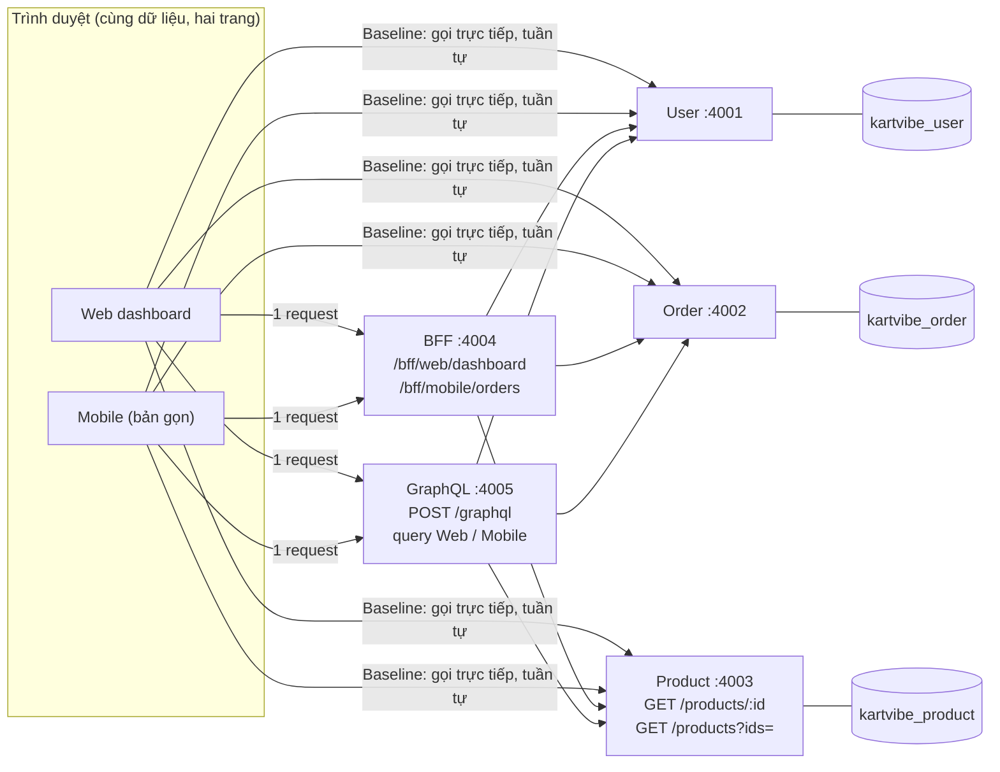

# Ghi chú trình bày Block 2

Đề yêu cầu trình bày **năm phần**: Problem, Solution, Demo, Evidence, Trade-off. Demo phải chạy thật trên dữ liệu nhỏ (S), không thay bằng ảnh chụp mã. Thời lượng mỗi phần dưới đây là gợi ý (đề không nêu), chỉnh theo thời gian giảng viên cho.

> Số liệu trong tệp này lấy từ các lần chạy đã kiểm chứng trên dữ liệu S. **Số đo nhiều lần (lạnh/ấm, median, khoảng) chỉ dùng khi đã có `results/evidence/measurements.md` thật**; trước đó chỉ nói các số đếm (request, lời gọi, truy vấn), vốn xác định.

## Khung nói (khoảng 10 phút)

| # | Phần | Gợi ý | Nói gì |
|---|---|---|---|
| 1 | Problem | 1,5' | Dashboard cần dữ liệu từ ba service. Baseline: trình duyệt gọi tuần tự rồi tự ghép → nhiều request, waterfall, và client biết quá nhiều về cấu trúc phía sau |
| 2 | Solution | 3' | Hai cách ghép ở server (BFF, GraphQL), cùng đọc ba service. Sơ đồ + các quyết định (mục dưới) |
| 3 | Demo | 3' | Chạy thật trên trang: baseline → BFF → GraphQL N+1 → GraphQL đã sửa → Product lỗi |
| 4 | Evidence | 1,5' | Bảng số, trace N+1, call graph, đối chiếu dữ liệu |
| 5 | Trade-off | 1' | BFF so với GraphQL, giới hạn phép đo |

## 1. Problem

- Một màn hình cần: tên người dùng (User), danh sách đơn (Order), tên và giá product (Product). Hai client dùng chung dữ liệu: web đầy đủ trường, mobile (web gọn) chỉ cần mã đơn, trạng thái, tên và thumbnail.
- Baseline (dữ liệu S: 5 đơn, 15 item): web gọi **17 request nối tiếp** (1 User + 1 Order + 15 Product, mỗi item một lần), mobile gọi 16.
- Hai vấn đề: (a) **waterfall** do request sau chờ request trước; (b) client phải biết ba service và tự ghép.
- Dữ liệu L (50 đơn, 200 item): baseline 202 request. Số request tăng theo số item.

## 2. Solution

### Kiến trúc

Mỗi service **một database riêng** (ba database trong cùng một Postgres), không khóa ngoại xuyên database. BFF và GraphQL chỉ gọi service qua REST, không truy vấn DB.

### Các quyết định (và vì sao)

| Quyết định | Lý do | Giá phải trả |
|---|---|---|
| Thêm endpoint **lấy nhiều product** (`GET /products?ids=`, loại id trùng, một truy vấn) | Muốn giảm lời gọi và truy vấn tới Product, service phải cho phép gom; lớp ghép không tự làm được | Product phải thay đổi; mọi lớp ghép phụ thuộc vào nó |
| **BFF**: hai endpoint, mỗi loại client một | Mỗi màn hình nhận đúng dữ liệu của nó, một request | Thêm endpoint cho mỗi màn hình |
| BFF gọi User và Order **song song**, rồi Product **một lần** với id đã loại trùng | Các lời gọi độc lập không nên chờ nhau; id trùng thì không cần hỏi lại | Product phụ thuộc kết quả Order nên không song song được hoàn toàn |
| Mobile **không gọi User** | Danh sách đơn mobile không có thông tin người dùng | Số lời gọi User ở mobile là 0 |
| **GraphQL**: một endpoint, hai query | Client tự chọn trường; phục vụ cả hai client bằng một API | Dễ phát sinh N+1 |
| GraphQL **tái hiện N+1** rồi sửa bằng **batching + loại trùng trong một request** (DataLoader, tạo mới mỗi request) | Resolver chạy cho từng item nên mỗi item gọi Product riêng; gom id trong cùng một request thành một lời gọi | Loader theo request nên không dùng chung cache giữa các request/người dùng |
| **Policy lỗi: trả dữ liệu một phần** cho cả BFF và GraphQL; `product: null`, đánh dấu lỗi, **không điền giá trị giả** | Một Product lỗi không nên làm hỏng cả dashboard; nhưng không được bịa tên/giá | Client phải xử lý dữ liệu thiếu (hiện “—”) |
| **Timeout Product 1000 ms** | Product chậm không được kéo dài vô hạn | Quá ngưỡng thì coi là lỗi dù Product có thể trả lời sau đó |
| Order Service luôn **2 truy vấn** (đơn, rồi tất cả item) | Số truy vấn cố định, không phải N+1 ở Order | Hai truy vấn thay vì một JOIN |
| **Không đưa tổng tiền** vào hợp đồng | Tránh nhân đôi lời gọi Product ở GraphQL ngây thơ; trang tự tính để hiển thị | Server không trả tổng |
| Ảnh thumbnail **không tải** (chỉ là chuỗi) | Ảnh sẽ làm sai số request | Demo không có hình |
| **x-request-id** truyền từ lớp ghép xuống mọi service, log mỗi lời gọi | Làm trace N+1 và call graph từ log thật | Cần mọi service ghi log đúng định dạng |

### Một câu kết luận kỹ thuật (từ đề)
Giảm request ở browser chưa chắc giảm truy vấn ở backend, và GraphQL không mặc định tốt hơn REST. Chứng cứ: GraphQL ngây thơ chỉ có 1 request từ client nhưng Product vẫn nhận 15 lời gọi.

## 3. Demo (dữ liệu S)

Chạy `npm run start:measure` (trong `services/`) và, ở terminal khác, `npm start` (trong `web/`), mở `http://localhost:4000/dashboard.html`, mở DevTools (Network, Disable cache). Với mỗi chế độ bấm "Tải dữ liệu" và chỉ vào bảng "Phía service":

| Bước | Chế độ | Chỉ ra |
|---|---|---|
| 1 | Baseline REST | 17 request, waterfall bậc thang; Product nhận 15 lời gọi / 15 truy vấn |
| 2 | BFF | 1 request; Product nhận 1 lời gọi / 1 truy vấn |
| 3 | GraphQL (DataLoader tắt) | 1 request nhưng Product vẫn **15 / 15**: đây là N+1 |
| 4 | GraphQL (đã sửa) | 1 request, Product **1 / 1** |
| 5 | Bấm "Product lỗi 500", tải BFF rồi GraphQL | Trạng thái "Một phần", product thiếu hiện “—” |
| 6 | Bấm "Product chậm 1500 ms", tải BFF | Quá timeout nên cũng ra một phần |

Có thể mở thêm `mobile.html` (16 request ở baseline, 1 ở BFF/GraphQL; payload nhỏ hơn).

**Chuẩn bị trước:** dữ liệu là S (`npm run seed:s`); Product ở "bình thường"; tab ở nền trước; đã thử chạy một lần trước khi trình bày. Có phương án dự phòng: `npm run check:equality` và `npm run check -- --size S` (chạy trong `services/`) chạy được trong terminal nếu trình duyệt trục trặc.

## 4. Evidence (nơi lấy)

| Bằng chứng | Vị trí |
|---|---|
| Trace N+1 trước/sau (15 và 200 dòng log Product so với 1) | `results/evidence/trace-n1-S.md`, `trace-n1-L.md` |
| Call graph nội bộ của BFF | `results/evidence/call-graph-bff-S.md` |
| Đối chiếu dữ liệu baseline = BFF = GraphQL (web, mobile) | `npm run check:equality` (trong `services/`); `results/verification/` |
| Mobile chỉ có trường mobile | Cùng bộ đối chiếu |
| Kết quả khi Product chậm hoặc lỗi | `npm run check:live -- S on --faults` (trong `services/`); `results/verification/` |
| Bảng đo thô nhiều lần (lạnh/ấm, median, khoảng) | `results/evidence/measurements.md` (**chỉ có khi đã chạy ma trận đo**) |
| Waterfall baseline, BFF, GraphQL | Chụp bằng DevTools (**chưa chụp**) |

## 5. Trade-off

| | BFF | GraphQL |
|---|---|---|
| Ưu | Đơn giản, dễ kiểm soát số lời gọi; hợp ít màn hình | Một endpoint cho nhiều client; client tự chọn trường |
| Nhược | Mỗi màn hình thêm một endpoint; gắn chặt với giao diện | N+1 nếu không batching; truy vấn có thể nặng; khó cache HTTP |
| Chung | Cả hai là điểm tập trung: thêm một bước nhảy mạng, và là điểm nghẽn/lỗi mới | |

Quan điểm có thể nêu (cho dashboard này, một web và một mobile cùng dữ liệu): BFF là đủ và đơn giản hơn; GraphQL hợp khi có nhiều client hơn với nhu cầu dữ liệu khác nhau.

### Giới hạn phép đo (nói thẳng)
- Cùng một máy chạy service, DB và trình duyệt; độ trễ mỗi service là **giả lập cố định** nên chênh lệch tuyệt đối không phản ánh môi trường thật.
- Đo lạnh chỉ khởi động lại ứng dụng; cache của Postgres và hệ điều hành còn nguyên.
- Ngưỡng 5 lần là đề xuất của bài tập, không phải quy chuẩn; mẫu nhỏ.
- "Hoàn tất" là DOM đã cập nhật xong, chưa chắc trình duyệt đã vẽ xong.
- Baseline gọi Product mỗi item một lần (không loại trùng ở client); đây là giả định của nhóm.

## Câu hỏi dự kiến và người trả lời

| Câu hỏi | Gợi ý trả lời | Ai |
|---|---|---|
| Vì sao BFF giảm request nhưng chưa chắc giảm truy vấn DB? | BFF gom lời gọi của client; nếu vẫn gọi Product từng item thì phía sau không đổi. Ở đây BFF giảm vì còn dùng endpoint lấy nhiều + loại trùng | Phú / Đạt |
| N+1 trong GraphQL xảy ra thế nào, sửa ra sao? | Resolver `product` chạy cho từng item; DataLoader gom id trong cùng một request, loại trùng, gọi một lần | Phú |
| Vì sao loader tạo mới mỗi request? | Cache theo id; dùng chung giữa request có thể rò dữ liệu hoặc giữ dữ liệu cũ | Phú |
| Vì sao "một phần" thay vì thất bại toàn bộ? | Không để một service phụ làm hỏng cả màn hình; nhưng không điền giá trị giả | Đạt / Phú |
| Vì sao Order luôn 2 truy vấn? | Số truy vấn cố định, tránh N+1 ở Order; hợp đồng chốt điều này | Thạnh |
| Endpoint lấy nhiều product xử lý id trùng/thiếu thế nào? | Loại trùng, bỏ qua id không có, sắp theo id, một truy vấn `= ANY(...)` | Luân |
| Cách đếm request, DB query, thời gian? | Hàm bọc `fetch` trong trang; `/_metrics` từng service; `performance.mark` sau cập nhật DOM cuối | Anh |
| Lạnh và ấm khác nhau thế nào? | Lạnh: lần đầu sau khi khởi động lại các service; ấm: các lần sau | Anh |
| Vì sao không dùng GraphQL cho mọi thứ? | Không mặc định tốt hơn REST; thêm độ phức tạp và rủi ro N+1; chỉ đáng khi nhiều client cần dữ liệu khác nhau | Phú |
| Điều gì chưa chứng minh được? | Hiệu năng ở môi trường thật (độ trễ giả, cùng một máy, mẫu nhỏ) | Anh |

## Lưu ý khi trình bày
- Mỗi người trình bày phải trả lời được các câu hỏi cốt lõi dù không làm phần đó; rút thăm người nói.
- **Đừng nêu số đo mà chưa chạy thật.** Nếu chưa có bảng đo nhiều lần, chỉ nêu các số đếm (xác định) và nói rõ phần số đo chưa hoàn tất.
- Không dùng câu trả lời của agent làm bằng chứng; chỉ vào log, bảng số, kết quả chạy thật.
