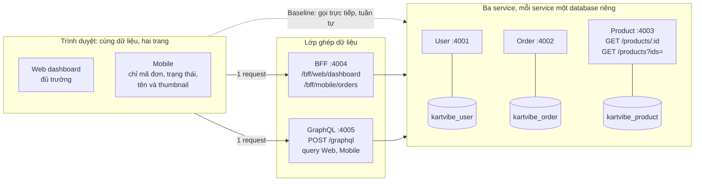
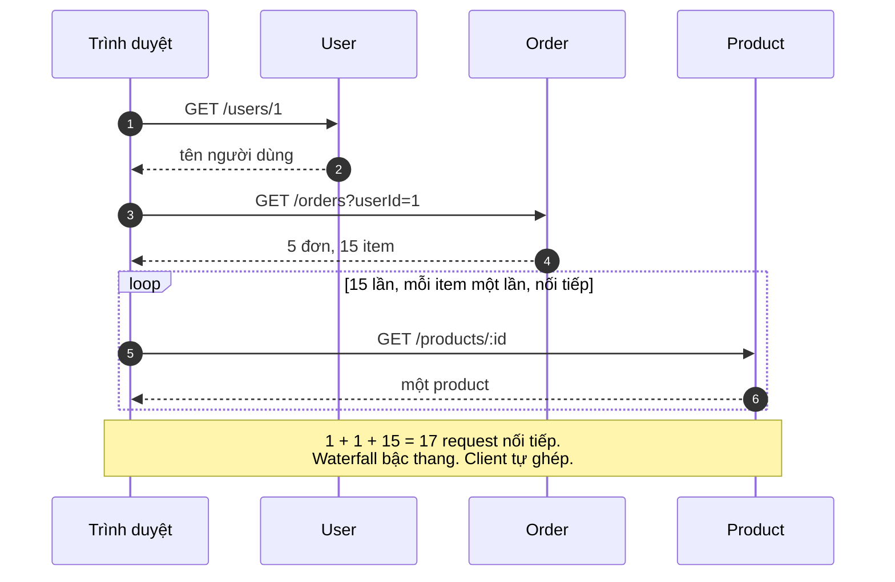
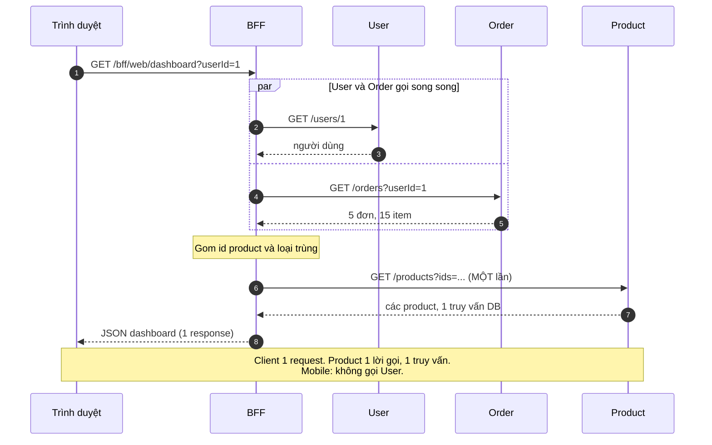
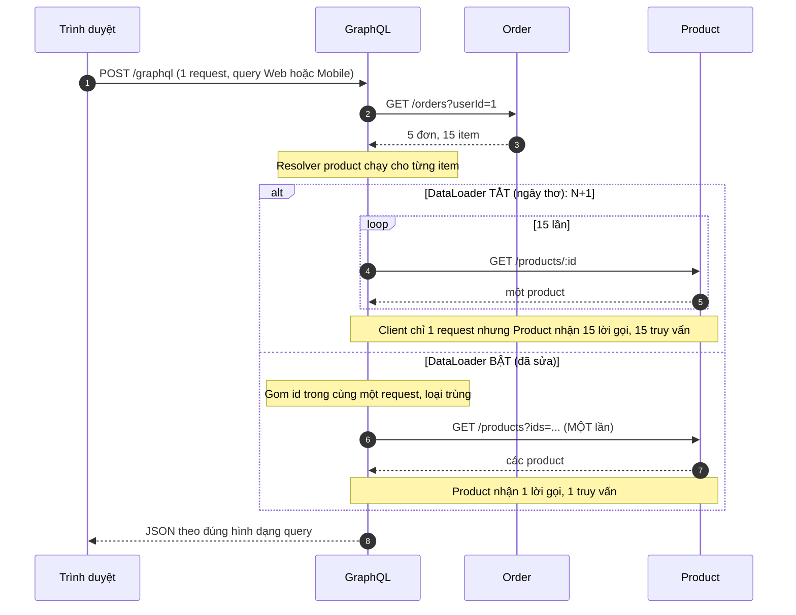
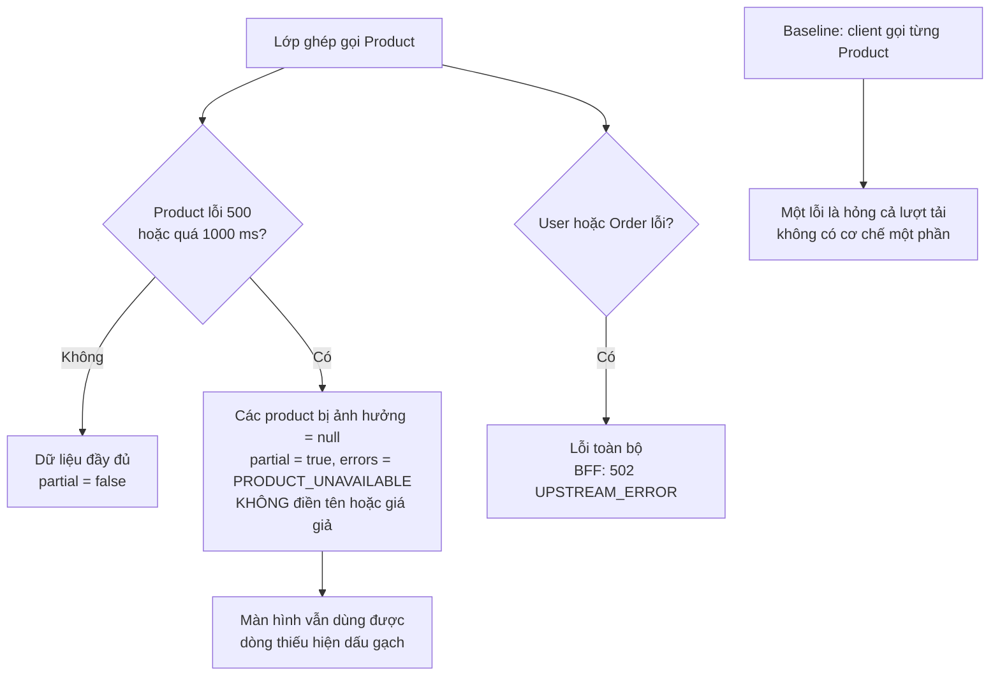
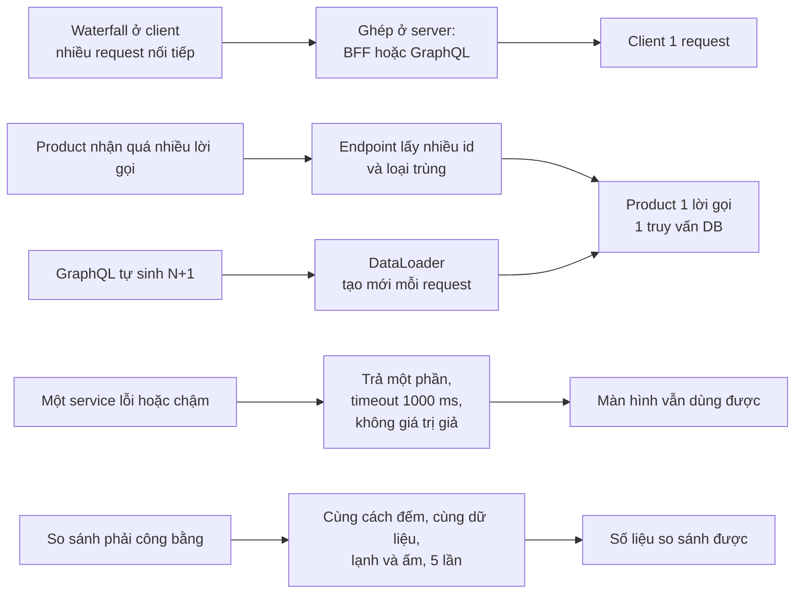
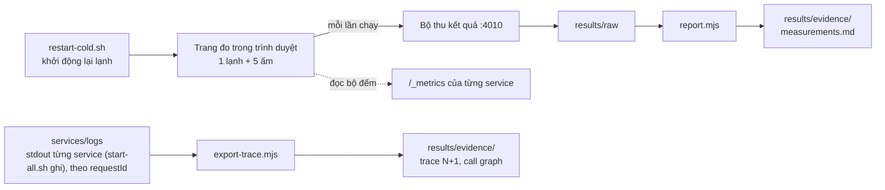
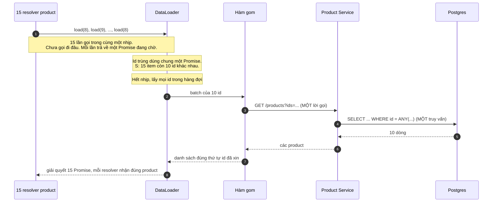

# Sơ đồ kiến trúc và quyết định (Block 2)

Dùng để trình bày. Xem trực tiếp trên GitHub hoặc bản xem trước Markdown của VS Code (có Mermaid), hoặc mở `so-do-kien-truc.html` trong trình duyệt (cần internet để tải thư viện Mermaid).

## 1. Kiến trúc tổng quan



**Điều cần nói:** ba đường đi từ cùng một trình duyệt đến cùng ba service. Khác biệt duy nhất là **nơi ghép dữ liệu**: ở client (baseline), ở BFF, hoặc ở GraphQL. BFF và GraphQL chỉ gọi service qua REST, không đụng vào database.

## 2. Baseline: trình duyệt gọi tuần tự (dữ liệu S: 17 request)



## 3. BFF: gom ở server (1 request từ client)



## 4. GraphQL: N+1 và cách sửa



**Điều cần nói:** giảm request ở browser **chưa** đồng nghĩa giảm truy vấn ở backend. GraphQL ngây thơ chứng minh điều đó.

## 5. Chính sách lỗi (BFF và GraphQL giống nhau)



## 6. Bản đồ quyết định: vấn đề → quyết định → kết quả



## 7. Luồng đo và bằng chứng



## 8. DataLoader bên trong: vì sao gom được

DataLoader **không chạm DB**. Nó chỉ làm cho lớp ghép gửi **một lô** thay vì 15 lời gọi lẻ. DB nhẹ đi vì lô đó chỉ tốn một câu SQL nhờ endpoint lấy nhiều của Product.



### Trước và sau khi gom

| | Không DataLoader | Có DataLoader |
|---|---|---|
| GraphQL gọi Product (S: 15 item) | 15 lời gọi | **1 lời gọi** (10 id khác nhau) |
| Product truy vấn Postgres (S) | 15 câu `WHERE id = $1` | **1 câu** `WHERE id = ANY($1)` |
| GraphQL gọi Product (L: 200 item) | 200 lời gọi | **1 lời gọi** (30 id khác nhau) |
| Product truy vấn Postgres (L) | 200 câu | **1 câu** |

### Đoạn mã cốt lõi (`services/graphql/src/schema.ts`)

```ts
const loader = new DataLoader(async (ids) => {
  const list = await getProducts(ids, requestId);     // MỘT lời gọi: /products?ids=...
  const byId = new Map(list.map((p) => [p.id, p]));
  return ids.map((id) => byId.get(id) ?? null);       // trả đúng thứ tự id đã xin
});
// resolver của OrderItem.product:  return loader.load(item.productId)
```

### Hai lưu ý
- **Loader tạo mới cho mỗi request:** cache id chỉ sống trong một request, không rò dữ liệu giữa người dùng hoặc giữ dữ liệu cũ.
- **Giới hạn kích thước lô:** hợp đồng cho phép tối đa 200 id mỗi lần và loader hiện không tách lô; có hơn 200 id khác nhau thì Product trả `400`. Dữ liệu S và L (10 và 30 id) không gặp vấn đề này.

**Một câu để nhớ:** DataLoader đổi "N lời gọi nhỏ" thành "1 lời gọi lớn" bằng cách chờ một nhịp để gom id; DB nhẹ đi vì lời gọi lớn đó chỉ tốn một câu SQL.
