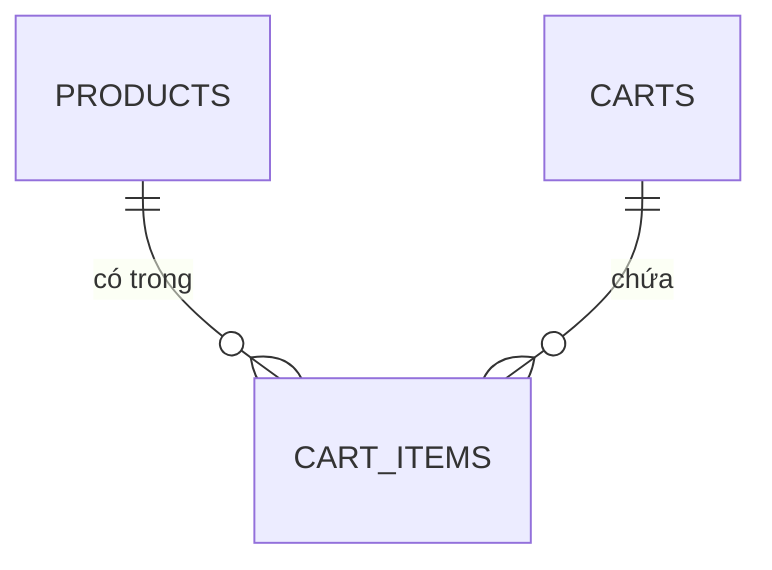

# Domain

Mô hình dữ liệu và quy tắc nghiệp vụ, chia theo domain. Mã đang tuân theo các tài liệu này.

Quy ước về cách trả lỗi (định dạng body, bảng mã lỗi ↔ HTTP status) nằm ở [api/docs/CONVENTIONS.md](../../api/docs/CONVENTIONS.md). Dữ liệu seed: [api/seeds/README.md](../../api/seeds/README.md).

## Nguồn sự thật
- Cấu trúc bảng: `api/prisma/schema.prisma` và migration. Tài liệu domain chỉ giải thích ý nghĩa và ràng buộc.
- Endpoint, schema request/response: `/openapi.json` do mã sinh ra.
- Tài liệu domain giải thích **quy tắc**, điều mà schema và spec không tự nói được.

## Các domain

| Domain | Nội dung | Trạng thái |
|---|---|---|
| [catalog](catalog.md) | Sản phẩm | có |
| [cart](cart.md) | Giỏ hàng và mục trong giỏ | có |
| order | Checkout, đơn hàng | chưa làm |
| inventory | Tồn kho | chưa làm (hiện `stock` nằm ở `products`) |

Chưa có: người dùng, đăng nhập, thanh toán.

## Quan hệ giữa các domain

Sơ đồ chỉ cho thấy các thực thể và đường nối. Cột và ràng buộc chi tiết nằm ở file của từng domain.

## Quy ước viết tài liệu domain
- Mỗi file có cùng khung: Dữ liệu, Trạng thái, Quy tắc, Luồng, Đồng thời.
- Quy tắc có ID ổn định theo domain (`CAT-01`, `CART-01`...). Không đánh số lại khi xóa; ghi "đã bỏ". Test và ADR trích dẫn ID này.
- Trong một file, nhóm quy tắc bằng tiêu đề theo chủ đề. Khi file vượt khoảng 300 dòng thì cân nhắc tách tiếp.
