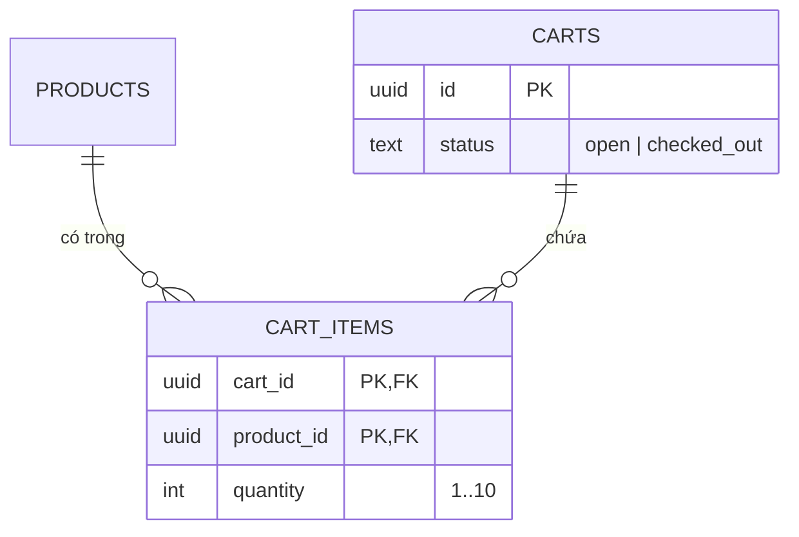
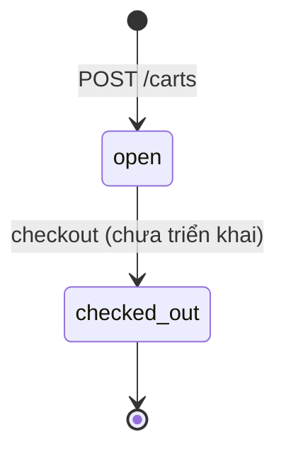
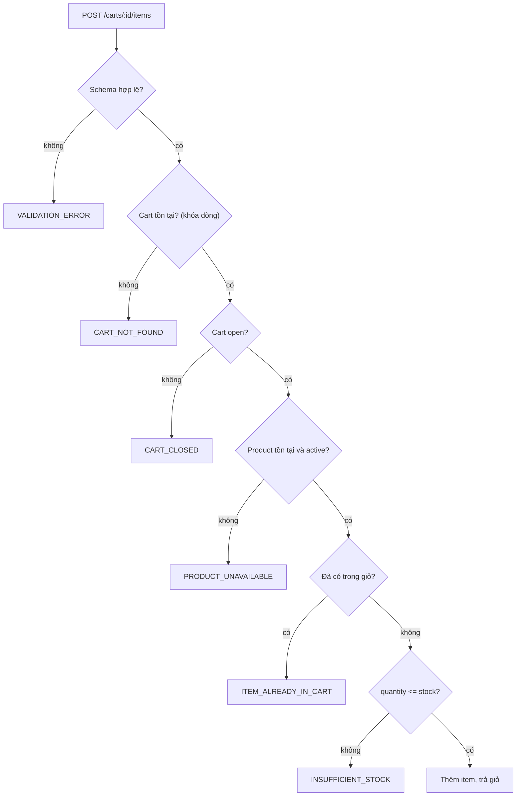

# Cart

Giỏ hàng và các mục trong giỏ.

## Dữ liệu



| Ràng buộc | Ý nghĩa |
|---|---|
| `cart_items` khóa chính `(cart_id, product_id)` | Mỗi sản phẩm tối đa một dòng trong một giỏ; đổi số lượng bằng PATCH, không cộng dồn |
| Xóa cart → xóa các `cart_items` (`ON DELETE CASCADE`) | |
| `quantity` từ 1 đến 10 | |

- UUID của cart do ứng dụng sinh (Prisma `uuid(4)`); migration không dùng extension hay default UUID.
- `CHECK` (status, quantity) được thêm tay vào migration; xem [ADR 0003](../decisions/0003-prisma.md).
- Không lưu tổng tiền.
- FK không tự tạo index phía `cart_items(product_id)`; xem lại khi có truy vấn theo sản phẩm hoặc xóa product.

## Trạng thái



Giỏ `checked_out` hiện chỉ tồn tại như dữ liệu seed (kèm item) để kiểm thử việc từ chối ghi và việc vẫn hiển thị item.

## Quy tắc

### Trạng thái giỏ
| ID | Quy tắc |
|---|---|
| CART-01 | Giỏ `open` được đọc và ghi. Giỏ `checked_out` vẫn đọc được nhưng mọi thao tác ghi (thêm, sửa, xóa item) bị từ chối: `CART_CLOSED`. |

### Giá và tổng tiền
| ID | Quy tắc |
|---|---|
| CART-02 | Giá luôn đọc từ `products`, không nhận từ client. Body có field `price` là field lạ, trả 400. |
| CART-03 | `subtotal_cents` không lưu DB, luôn tính lại từ giá hiện tại. Đổi giá sản phẩm sẽ đổi tổng của giỏ đang mở; giỏ rỗng có tổng 0. |
| CART-04 | Giỏ `checked_out` và sản phẩm bị ngừng bán sau đó vẫn hiện trong `items[]` và vẫn tính vào tổng. |

### Thêm, sửa, xóa item
| ID | Quy tắc |
|---|---|
| CART-05 | Chỉ sản phẩm `is_active = true` được thêm vào giỏ: `PRODUCT_UNAVAILABLE`. |
| CART-06 | Một sản phẩm chỉ có một dòng trong giỏ. Thêm lần hai trả `ITEM_ALREADY_IN_CART`; người dùng phải dùng PATCH. |
| CART-07 | PATCH `quantity` là số lượng mới tuyệt đối, không cộng thêm. PATCH đúng số lượng hiện tại vẫn trả 200. |
| CART-08 | PATCH không kiểm tra lại `is_active`: sản phẩm đã nằm trong giỏ vẫn sửa được (chỉ kiểm tra stock). **Hạn chế đã biết.** |
| CART-09 | DELETE không idempotent: xóa lần hai trả `ITEM_NOT_FOUND`. |
| CART-10 | Các item trong giỏ sắp xếp theo `name`, rồi `id`. Thứ tự theo `name` phụ thuộc collation của database. |

### Tồn kho
| ID | Quy tắc |
|---|---|
| CART-11 | `quantity` khi thêm hoặc sửa không được vượt `stock` hiện tại: `INSUFFICIENT_STOCK`. |
| CART-12 | Stock **không bị trừ** khi thêm vào giỏ (sẽ trừ lúc checkout, chưa làm). |

### Thứ tự kiểm tra
| ID | Quy tắc |
|---|---|
| CART-13 | Một request vi phạm nhiều quy tắc chỉ trả **lỗi đầu tiên** theo thứ tự ở mục "Luồng" bên dưới. Schema luôn đứng đầu và không chạm DB. |

## Luồng

### Hai tầng kiểm tra
**Tầng 1: schema (không chạm DB).** Chạy trong middleware cùng nguồn schema với OpenAPI. Sai thì trả ngay `VALIDATION_ERROR` (400): UUID sai ở path, `quantity` không phải số nguyên 1..10 (chuỗi `"2"` cũng sai), field lạ trong body, JSON hỏng.

**Tầng 2: nghiệp vụ (có chạm DB).** Chỉ chạy khi tầng 1 qua. Mỗi request chỉ trả **lỗi đầu tiên** theo thứ tự dưới đây.

| Bước | POST items | PATCH item | DELETE item |
|---|---|---|---|
| 1 | Schema | Schema | Schema |
| 2 | Cart tồn tại: `CART_NOT_FOUND` | giống POST | giống POST |
| 3 | Cart `open`: `CART_CLOSED` | giống POST | giống POST |
| 4 | Product tồn tại và active: `PRODUCT_UNAVAILABLE` | Item có trong giỏ: `ITEM_NOT_FOUND` | Item có trong giỏ: `ITEM_NOT_FOUND` |
| 5 | Chưa có trong giỏ: `ITEM_ALREADY_IN_CART` | Đủ stock: `INSUFFICIENT_STOCK` | Xóa |
| 6 | Đủ stock: `INSUFFICIENT_STOCK` | Cập nhật | |
| 7 | Thêm | | |

Nguyên tắc: schema → tồn tại trên URL → trạng thái giỏ → tham chiếu trong body → xung đột dữ liệu (trùng, rồi stock). "Đã có trong giỏ" đứng trước "không đủ stock" vì đó là lỗi gốc hơn: người dùng được hướng sang PATCH ngay thay vì sửa số lượng rồi mới biết là trùng. Hệ quả cho test: muốn thử vượt stock ở POST phải dùng sản phẩm chưa có trong giỏ.

Mã lỗi ↔ HTTP status: xem [api/docs/CONVENTIONS.md](../../api/docs/CONVENTIONS.md).



### Cách tính tổng tiền
Một lần đọc các dòng của giỏ kèm sản phẩm, tính trong mã bởi hàm dùng chung `buildCartResponse(cartId)` (dùng cho `GET`, `POST`, `PATCH` nên không lệch nhau):

```
subtotal_cents của item = price_cents × quantity
subtotal_cents của giỏ  = tổng các item   (giỏ rỗng → 0)
```

Toàn bộ là số nguyên cent, không dùng số thực. Ví dụ: 2 × 5000 + 1 × 15000 = 10000 + 15000 = **25000**.

## Đồng thời

| Endpoint | Transaction | Lý do |
|---|---|---|
| `GET /carts/:id`, `POST /carts` | không | Chỉ đọc hoặc một lệnh ghi |
| `POST` và `PATCH` item | có | Kiểm tra rồi ghi phải nguyên tử |
| `DELETE` item | không | Một lệnh xóa; cart được kiểm tra trước để phân biệt 404 và 409 |

Trong transaction, khóa dòng cart (`SELECT ... FOR UPDATE`) để các thao tác ghi trên **cùng một giỏ** chạy tuần tự; isolation mặc định `READ COMMITTED` là đủ. Không khóa dòng `products`. Chi tiết: [ADR 0008](../decisions/0008-row-lock-cart.md).

Lỗi DB lọt qua được ánh xạ phòng thủ, chỉ cho `INSERT` vào `cart_items`: `23505` (trùng khóa) → `ITEM_ALREADY_IN_CART`; `23503` (FK, product bị xóa giữa chừng) → `PRODUCT_UNAVAILABLE`. Vi phạm `CHECK` (`23514`) nghĩa là tầng 1 bị lọt, coi là bug: trả 500 và ghi log, không che bằng 400.

**Giới hạn đã biết:** transaction chỉ bảo vệ tính nhất quán trong **một giỏ**. Vì stock không bị trừ khi thêm vào giỏ, hai giỏ khác nhau cùng thêm sản phẩm `stock = 1` đều thành công. Đây là hành vi chấp nhận được khi chưa có checkout; đồng thời trên tồn kho cần quyết định riêng khi làm checkout.
