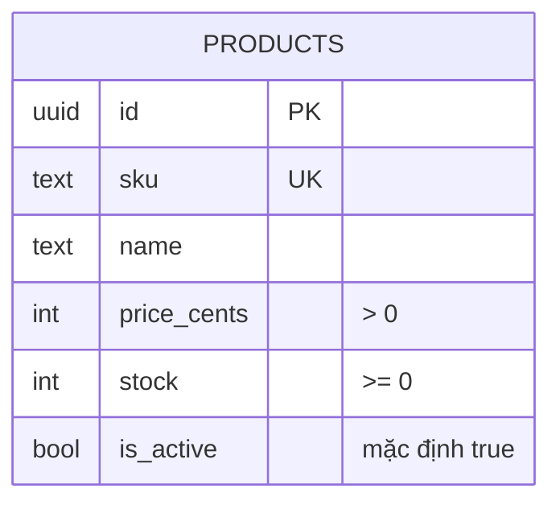

# Catalog

Sản phẩm có thể bán.

## Dữ liệu

- `price_cents` là số nguyên theo cent, tránh sai số số thực; chưa gắn với loại tiền nào.
- `stock` hiện nằm ở `products`. Khi có domain inventory riêng, cột này sẽ chuyển đi.
- Xóa product đang nằm trong giỏ bị chặn (`ON DELETE RESTRICT` ở `cart_items`).
- `CHECK` (giá > 0, stock ≥ 0) được thêm tay vào migration; xem [ADR 0003](../decisions/0003-prisma.md).
- Không có index ngoài khóa chính và `UNIQUE(sku)`: dữ liệu nhỏ, chưa có bằng chứng cần tối ưu. Chỉ thêm khi `EXPLAIN ANALYZE` cho thấy cần.

## Quy tắc

### Liệt kê sản phẩm
| ID | Quy tắc |
|---|---|
| CAT-01 | `GET /products` chỉ trả sản phẩm `is_active = true`. Sản phẩm hết hàng nhưng đang bán **vẫn được liệt kê** (không lọc theo `stock`). |
| CAT-02 | Sắp xếp theo `sku` để phân trang ổn định. |
| CAT-03 | `limit` là số nguyên 1..50 (mặc định 20), `offset` ≥ 0 (mặc định 0). Giá trị sai trả 400, không tự sửa. |
| CAT-04 | Trang không có phần tử nào (không có sản phẩm đang bán, hoặc `offset` vượt quá tổng) → `data: []`, vẫn trả 200. `total` luôn là tổng số sản phẩm đang bán, không phụ thuộc trang. |

## Luồng
`GET /products`: kiểm tra schema (`limit`, `offset`) → lấy các sản phẩm active theo `sku`, phân trang → đếm tổng số active → trả `{ data, total, limit, offset }`. Không cần transaction.

Mỗi sản phẩm trong `data` gồm `id`, `sku`, `name`, `price_cents`, `stock`. `is_active` không được trả (mọi sản phẩm trong danh sách đều đang bán).
