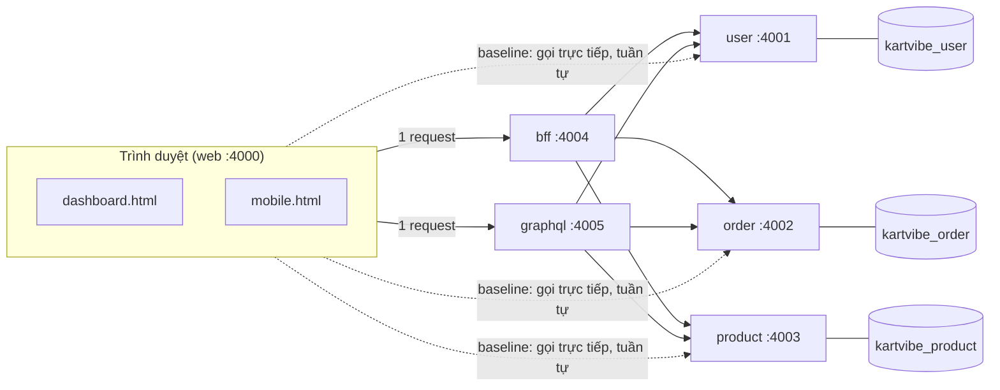

# services: API composition

Ba service REST (**User**, **Order**, **Product**, mỗi service một database riêng) cùng hai cách ghép dữ liệu ở server (**BFF** và **GraphQL**), và hai trang web (dashboard, mobile) để so sánh với cách gọi trực tiếp (**baseline**). Viết thành ba service riêng là yêu cầu của đề. Trong repo này nó **độc lập** với các dự án khác và chưa liên kết với chúng; việc đặt chung một repo là quyết định của nhóm.

Đề bài, hợp đồng chung, Plan, ghi chú trình bày và sơ đồ: [`../docs/blocks/block-02/`](../docs/blocks/block-02/). Công cụ kiểm tra và đo: [`tools/README.md`](tools/README.md).



| Thành phần | Cổng | Database | Ghi chú |
|---|---|---|---|
| `user` | 4001 | `kartvibe_user` | `GET /users/:id` |
| `order` | 4002 | `kartvibe_order` | `GET /orders?userId=`, luôn 2 truy vấn DB |
| `product` | 4003 | `kartvibe_product` | `GET /products/:id`, `GET /products?ids=` (lấy nhiều, loại id trùng, 1 truy vấn), công tắc gây lỗi `/_fault` |
| `bff` | 4004 | không | `GET /bff/web/dashboard`, `GET /bff/mobile/orders` |
| `graphql` | 4005 | không | `POST /graphql` (query `Web`, `Mobile`), công tắc `DATALOADER` |
| `../web` | 4000 | không | Trang `dashboard.html`, `mobile.html`. **Không** do `start-all.sh` chạy: chạy riêng bằng `npm start` trong `web/`; `npm run matrix` tự bật nếu chưa chạy |
| bộ thu kết quả | 4010 | không | Nhận từng lần đo từ trang (`tools/measure.mjs`). **Chỉ chạy khi cần đo**: `npm run collector`, hoặc tự khởi động bởi `npm run matrix` |

Mọi service có thêm `GET /health`, `GET /_metrics` (số request và truy vấn DB), `POST /_metrics/reset`.

## Yêu cầu

- Node.js 22 trở lên (đã thử trên 24).
- Docker với container Postgres `kartvibe-postgres` ở cổng **5434**. Chưa có thì tạo một lần (các database của `services` do `start-all.sh` tự tạo):

  ```bash
  docker run -d --name kartvibe-postgres -e POSTGRES_PASSWORD=postgres -p 5434:5432 postgres:17
  ```
- Các cổng 4000 đến 4005 và 4010 còn trống.

## Chạy

```bash
cd services
npm install              # lần đầu (npm workspaces: một lần cho cả 5 service)
bash start-all.sh        # tạo database còn thiếu; chạy 5 service (như bình thường)
npm run start:measure    # thay cho start-all.sh khi cần demo lỗi, đo hoặc chạy các kiểm tra (xem dưới)
npm run seed:s           # nạp dữ liệu nhỏ (npm run seed:l cho dữ liệu lớn)
bash stop-all.sh         # dừng năm service
```

Trang web chạy riêng, ở terminal khác: `cd ../web && npm start` (cổng 4000).

Thứ tự lần đầu là `start-all.sh` (tạo database) rồi `seed`. `start-all.sh` chạy service như bình thường, không có độ trễ giả hay điểm vào gây lỗi; các móc đó là phần cắm thêm của `npm run start:measure`. Đổi dữ liệu S hoặc L không cần khởi động lại service. PID nằm ở `.run/`; log của từng service (stdout do `start-all.sh` ghi) nằm ở `logs/` (không commit, đổi bằng `LOG_DIR`).

| Dữ liệu | Đơn | Item mỗi đơn | Product | Tổng item |
|---|---:|---:|---:|---:|
| S (nhỏ, dùng để demo) | 5 | 3 | 10 | 15 |
| L (lớn) | 50 | 4 | 30 | 200 |

## Demo

Để thấy waterfall rõ và dùng ba nút lỗi của Product, chạy bằng `npm run start:measure` (độ trễ giả 30 ms và điểm vào `/_fault`); `start-all.sh` thuần không có hai thứ đó. Mở http://localhost:4000/dashboard.html (hoặc `/mobile.html`), chọn **Chế độ**, bấm **Tải dữ liệu**. Trang hiện số request client, payload, thời gian hoàn tất, bảng **số liệu phía từng service** và lịch sử so sánh các lần tải. Có ba nút bật/tắt lỗi cho Product (bình thường, chậm 1500 ms, lỗi 500).

Số kỳ vọng với dữ liệu S, web (mobile: baseline 16 request):

| Chế độ | Request client | Product nhận (request / truy vấn DB) |
|---|---:|---|
| Baseline REST | 17 | 15 / 15 |
| BFF | 1 | 1 / 1 |
| GraphQL (DataLoader tắt, N+1) | 1 | 15 / 15 |
| GraphQL (đã sửa, DataLoader bật) | 1 | 1 / 1 |

Đây là số đếm tính từ hợp đồng và đã kiểm chứng; số đo thời gian nhiều lần xem mục **Đo**. Để xem waterfall: DevTools (Chrome) → Network → *Disable cache*.

## Kiểm tra

Chạy từ `services/` khi các service đang chạy bằng `npm run start:measure` (các kiểm tra cần `/_fault` của Product; thiếu thì `check` báo ngay). Chi tiết từng lệnh: [`tools/README.md`](tools/README.md):

| Lệnh | Kiểm tra |
|---|---|
| `npm run check -- --size S` | Cả 5 service đúng hợp đồng chung (80 kiểm tra khi đủ 5 service; response được kiểm theo `openapi.json` của từng service) |
| `npm run check:equality` | Baseline = BFF = GraphQL cho web và mobile; mobile chỉ có trường mobile |
| `npm run check:live -- S on [--faults]` | Đối chiếu và chạy lỗi (chậm, 500); báo cáo ở `../results/verification/` |
| `npm run trace -- --size S` | Xuất trace N+1 và call graph BFF từ log thật vào `../results/evidence/` |
| `npm run contracts:check` | `openapi.json` và kiểu sinh ra khớp với `src/contract.ts` (sửa hợp đồng thì chạy `npm run contracts`) |
| `npm run test:tools` | Test của bộ đo và của hợp đồng |
| `cd graphql && npm test -- --size S` | Bộ kiểm tra riêng của GraphQL (N+1 trước/sau, policy lỗi) |

## Đo

Số liệu đo nhiều lần (4 biến thể × 2 client × 2 kích thước, mỗi cấu hình 1 lần lạnh + 5 lần ấm) chạy **trong trình duyệt thật**:

- **Từng cấu hình:** mở một terminal chạy `npm run collector` (bộ thu kết quả, giữ chạy); ở terminal khác `bash tools/restart-cold.sh [on|off]` (khởi động lại lạnh, in `COLD_SESSION=...`; `off` cho biến thể `graphql-naive`), rồi mở trang và dùng ô "Công cụ đo số liệu" (thu gọn ở cuối trang): dán cold session, chọn biến thể và kích thước, bấm **Chạy 1 lạnh + 5 ấm**.
- **Cả ma trận:** `npm run matrix` (tự nạp dữ liệu, khởi động lại lạnh, tự bật web nếu chưa chạy, mở trang bằng trình duyệt mặc định, chờ kết quả; thêm `--dry` để xem kế hoạch). Giữ cửa sổ trình duyệt ở nền trước và không làm việc khác trên máy.
- **Báo cáo:** `npm run report` tạo `../results/evidence/measurements.md` từ `../results/raw/`.

Cách đếm các chỉ số, định nghĩa "màn hình hoàn tất", lạnh/ấm và giới hạn của phép đo: [hợp đồng chung](../docs/blocks/block-02/hop-dong-chung.md) (mục 7) và [ghi chú trình bày](../docs/blocks/block-02/TRINH-BAY.md).

## Cấu hình thường dùng

Mỗi service có `.env.example` riêng. Muốn đổi cấu hình, sao chép thành `.env` **trong thư mục của service đó** (`user/.env`, `order/.env`, ...); `.env` không commit. Service tự nạp `.env` ở thư mục chạy nếu có (`src/env.ts`); biến đã đặt trong shell hoặc do `start-all.sh` đặt được ưu tiên hơn file. Không có `.env` thì dùng giá trị mặc định trong mã. Không đặt `DATABASE_URL` dùng chung: mỗi service một database riêng.

| Biến | Mặc định | Ý nghĩa |
|---|---|---|
| `LATENCY_MS` | `0`; `npm run start:measure` đặt 30 | Độ trễ giả mỗi request nghiệp vụ của user, order, product |
| `DATALOADER` | `on` | GraphQL: `off` là bản ngây thơ (N+1); ghi đè từng request bằng `POST /graphql?dataloader=off\|on` |
| `PRODUCT_TIMEOUT_MS` | 1000 | BFF và GraphQL coi Product quá hạn là lỗi (trả một phần) |
| `REQUIRE_POSTGRES` | mã: tắt; `start-all.sh` đặt `1` | Product báo lỗi thay vì tự chuyển sang dữ liệu trong bộ nhớ khi mất kết nối Postgres |
| `NO_DOCKER` | không đặt | `1` để `start-all.sh` bỏ qua bước Docker/Postgres |
| `ENABLE_TEST_HOOKS` | tắt; `npm run start:measure` đặt `1` | Bật `/_fault` và `/_seed` của Product (demo lỗi, đo và test) |
| `LOG_DIR` | `services/logs` | Nơi `start-all.sh` ghi log (stdout) của từng service; công cụ thu bằng chứng đọc từ đây |

Policy lỗi: Product lỗi hoặc quá hạn thì `product` là `null`, `partial` là `true` (BFF) hoặc có mục trong `errors` (GraphQL); **không điền tên hay giá giả**. User hoặc Order lỗi thì lỗi toàn bộ.

## Cấu trúc

```
services/
  user/ order/ product/ bff/ graphql/   năm service (README, .env.example riêng)
                                        mỗi service: src/index.ts (điểm vào), env.ts, logger.ts, db.ts + seed.ts (nếu có DB), test/
  start-all.sh  stop-all.sh             chạy và dừng tất cả
  package.json  package-lock.json       npm workspaces (một lần npm install)
  */src/contract.ts  */openapi.json     hợp đồng do từng service sở hữu (Zod → OpenAPI 3.1, ADR 0011)
  tools/                                công cụ kiểm tra và đo (xem tools/README.md)
../web/                                 trang dashboard, mobile và bộ chạy đo trong trang
../results/                             bằng chứng: evidence/, verification/, raw/
```

## Xử lý sự cố

| Triệu chứng | Nguyên nhân thường gặp |
|---|---|
| `Docker không chạy` khi `start-all.sh` | Bật Docker Desktop, hoặc đặt `NO_DOCKER=1` nếu không cần DB |
| Trang báo lỗi 500 khi gọi Product | Công tắc lỗi của Product đang bật: bấm "Product bình thường" hoặc `curl -X POST localhost:4003/_fault -H 'Content-Type: application/json' -d '{}'` |
| Một service "CHƯA phản hồi" | Xem `logs/<tên>.log`; thường do cổng bị chiếm hoặc chưa tạo database/bảng (chạy `npm run seed:s`) |
| Số đo không giống kỳ vọng | Kiểm tra dữ liệu đang là S hay L, và công tắc lỗi/DATALOADER |

## Giới hạn đã biết

- Toàn bộ dữ liệu là giả; mật khẩu Postgres `postgres`/`postgres` chỉ dùng cục bộ.
- Độ trễ mỗi service là giả lập cố định và mọi thứ chạy trên một máy, nên chênh lệch tuyệt đối không phản ánh môi trường thật.
